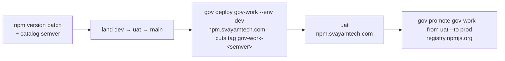

# Contributing to the Agentic Development Framework

Thanks for considering a contribution. This guide explains where to send changes, what they go through, and how to maximize the chance of a smooth merge.

---

## Where to send changes

**Contributions target `dev`.** There is no `publish` branch — this guide said so until 2026-09-16
and it had not existed for some time. The branches are `dev`, `uat` and `main`.

Work in this repository follows the same flow as any other project the framework governs: **cut your
branch from `dev`, and changes promote `dev` → `uat` → `main`.** Nothing lands on `main` except by
promotion (Policy Owner, 2026-09-15). `main` is what an adopter's `install.sh` and the install site
serve, which is why it is the end of the chain rather than the start.

If you're an adopter (you cloned this template into your own org), you typically don't contribute back upstream — you customize your fork. Contributions are about improving the framework itself: scripts, validators, policy templates, governance machinery, documentation.

---

## Quick path

1. Fork the repository (or create a feature branch in a fork).
2. Make your change. Keep it focused — one concern per PR.
3. Run the local checks (see below).
4. Open a pull request targeting `dev`.
5. CI runs the client on three OSes, the bootstrap installer on a machine with no Node, and the adopter smoke run — see below.
6. A maintainer reviews. Address feedback by pushing more commits — don't force-push unless asked.

---

## Local checks before pushing

```bash
# Bash syntax
bash -n scripts/lib.sh scripts/*.sh prj

# Validators (schema, registry, lifecycle, cross-references)
python3 scripts/validate/run.py

# If you touched policy or guidance markdown, check links/placeholders manually
```

Failing local checks will fail in CI too — save yourself a round trip.

---

## What CI runs on your PR

- **`node-ci`** — the client built, linted and tested on Linux, macOS and Windows, plus the
  full-flow e2e gate. `fail-fast` is off on purpose: when Windows breaks it should be visible
  whether macOS did too.
- **`node-ci` / bootstrap installer** — `install.sh` and `install.ps1` on a machine with no Node at
  all, with the runner's own Node stripped from `PATH`. The only place `install.ps1` is exercised.
- **`adopter-e2e`** — the hermetic adopter smoke run, and the live-GitHub journey.
- **`catalog-freshness`** — weekly, not per-PR: checks each approved agent's context filename against
  its published package.

All required checks must pass before merge. They are not gating opinion — they catch concrete
invariant violations that would reach an adopter.

---

## Conventions

### Branches

- Framework changes: `<short-topic>-<your-handle>` (e.g., `add-archive-flag-jdoe`)
- Knowledge proposals (policy/guidance edits without script changes): `knowledge-<topic>` — these can use `scripts/propose-knowledge.sh` to scaffold

### Commits

- One logical change per commit. If a commit message starts with "and", split it.
- Subject line: short imperative ("add cancel reason", "fix race in close-project"), under 72 chars.
- Body: explain *why*, not what. The diff shows what; the body explains the motivation, the alternative considered, the constraint that drove the design.

### Code style

- **Bash**: `set -euo pipefail` at the top. Quote variables. Use `[[ ]]` for tests. Source `lib.sh` from `scripts/`.
- **Python**: target Python 3.10+. PEP 8 with reasonable line length. Standard library only where possible (pyyaml is the one allowed dep).
- **Markdown**: 1 blank line between sections, GitHub-flavored markdown, no trailing whitespace.
- **YAML**: 2-space indent, no tabs. Comments explaining each top-level key are appreciated.

### Placeholders

The framework uses double-curly placeholder syntax for values substituted by `setup.sh`. The examples below are shown with spaces inside the braces so that this documentation file itself isn't subject to substitution. **In actual templated files, drop the inner spaces** — the substitution regex matches the no-space form only.

- `{{ ORG_NAME }}`, `{{ ORG_SHORT_NAME }}`, `{{ ORG_SLUG }}`, `{{ org_slug }}` (lowercase variant for branch names)
- `{{ GITHUB_ORG }}`, `{{ WORKSPACE_REPO }}`, `{{ DEFAULT_BRANCH }}`, `{{ DEFAULT_CODE_BRANCH }}`
- `{{ POLICY_OWNER_EMAIL }}`, `{{ POLICY_OWNER_GITHUB }}`, and the other role handles
- `{{ POLICY_EFFECTIVE_DATE }}`

`setup.sh` only substitutes placeholders in `*.md`, `*.yaml`, `*.yml`, and `CODEOWNERS` files. **Do not put placeholders in shell scripts or Python** — they won't get substituted and will leak through to downstream consumers as literal placeholder text. Use prose or runtime config reads instead.

### Tests — the governance test bed (BATS)

> **This section describes the FROZEN bash CLI** (`@svayam-opensource/prj`, at
> `publish/actions/deprecated/`), which is deprecated and no longer published. For the current
> TypeScript client the checks are `npm run build`, `npm run lint`, `npm test`, `npm run test:e2e`
> and `npm run test:adopter:smoke`, all from `publish/actions/ts`.

The governance test bed lives in `tests/bats/` (BATS). Run it locally with:

```bash
bash tests/bats/run.sh        # fetches pinned bats libs, runs every tests/bats/*.bats
```

It gated the npm publish through `ci/Jenkinsfile`, which was **deleted in 2026-09-16**: it
published `@svayam-opensource/prj`, now deprecated, and gated on paths that had moved under
`publish/actions/deprecated/`. Publishing is gov-cicd's `gov-work` unit — see **Releasing** below. Design + roadmap: `tests/TESTBED-DESIGN.md`.

**Rule: a new or changed command must adjust the test bed in the same PR.** Two
gates enforce it automatically:

- **Command-coverage ratchet** (`tests/bats/check_coverage.sh`): every command in
  `prj`'s dispatch must have a `tests/bats/<command>.bats`, or be listed in
  `tests/bats/coverage-baseline.txt` (accepted pre-existing debt — only shrinks).
  Add a command without a test → the gate fails. Don't add new commands to the
  baseline; write the test.
- **CLI-surface snapshot** (`tests/bats/help.bats` vs
  `tests/bats/golden/help-detail.txt`): any change to the command/option surface
  flips the snapshot. After a *deliberate* change run
  `bash tests/bats/update-golden.sh`, review the diff, and make sure the affected
  command's `.bats` was updated too.

The legacy `scripts/validate/run.py` validators still run as org-content
invariant checks; the existing `tests/*.sh` are being migrated into the BATS bed.

---

## Releasing

**One path: `gov`.** `@svayam-opensource/gov` is the gov-cicd catalog unit `gov-work`, and every
version reaches a registry through `gov deploy` / `gov promote` — nothing in this repository publishes.
No GitHub Actions workflow, no Jenkinsfile, no hand `npm publish`, and no npm token stored as a
repository secret: the publish credential lives in gov's cred store.



- **Three copies of the version must agree:** `package.json`, `package-lock.json`, and `semver:` for
  `gov-work` in the org's `knowledge/deployment/catalog/services.yaml`. `npm version` writes the first
  two; hand-editing `package.json` leaves the lock behind, and the version gate refuses.
- **Release tags are gov's, named `gov-work-<semver>`.** A `dev` deploy cuts the tag; `uat` and `prod`
  require it and never re-cut. Do not push `v*` tags as a release mechanism.
- **Fetch the mirror first**, or the recorded `content_sha` describes a stale tree — see
  [releasing-and-the-stale-mirror.md](releasing-and-the-stale-mirror.md).

`publishConfig.registry` in `package.json` points at the internal registry on purpose: that is the
contributor default, and the public registry is only ever reached explicitly, by the `prod` promote.

**Add your change to `CHANGELOG.md` under `## Unreleased`** in the same PR.

On 2026-09-17 a tag-triggered GitHub Actions publish (added in #236 for #235) was removed before it
ever ran: it was a second path to the same registry, built on the mistaken premise that nothing in CI
published gov.

---

## Filing an issue

Use the templates in `.github/ISSUE_TEMPLATE/`:

- **Bug report** — something works incorrectly. Include reproduction steps, expected vs actual, environment.
- **Feature request** — propose a capability. Explain the use case, not just the feature.
- **Question** — ask about usage. Search existing issues first.

For security issues, see [SECURITY.md](SECURITY.md). Don't file public issues for vulnerabilities.

---

## Maintainer expectations

PRs are typically responded to within a few days. If a PR sits without feedback for more than a week, ping the maintainers in a polite comment. Some changes (especially to the policy template or compliance machinery) need broader review and may take longer.

A PR may be:

- **Merged** — congratulations
- **Requested changes** — address feedback by pushing more commits
- **Deferred** — the maintainer thinks it's reasonable but not now; will be revisited
- **Declined** — the maintainer thinks it doesn't fit the framework's scope; the rationale will be in the PR thread

Declined PRs are not personal. The framework intentionally has a small surface — fewer features means easier governance.

---

## Code of conduct

By participating, you agree to abide by the [Code of Conduct](CODE_OF_CONDUCT.md).
