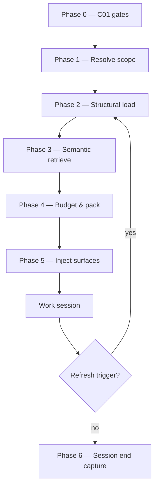

# Agent Context Assembly Specification

**Status:** Draft — design only, not implemented  
**Owner:** Infrastructure Owner (acting: `{{POLICY_OWNER_EMAIL}}`)  
**Parent policy:** `knowledge/policies/agentic-development-policy.md` (POL-076–081, POL-113–123, POL-129–138)  
**Related specs:** `knowledge/infrastructure/knowledge-publication-spec.md`, `knowledge/guidance/scripts/close-knowledge-spec.md`  
**Audience:** Infrastructure Owner, Policy Owner, agent harness maintainers, framework implementers

---

## 1. Purpose

This specification defines **how an agent assembles working context** from organizational knowledge — not merely *where* knowledge lives (policy Section 6) or *that* layers must be loaded fresh at session start (POL-116), but:

- **What** to retrieve (structural vs semantic)
- **In what order** (layer precedence + priority tiers)
- **How much** fits in the prompt budget
- **Where** each piece is injected (system rules, user message, tool-readable files, ephemeral session state)
- **What may persist** across turns within a session vs what must be re-loaded every session
- **When** to refresh context mid-session

Vector RAG (Form 3 in the knowledge publication spec) is **one retrieval input** to this assembly process — not the whole process.

### 1.1 Success criteria

An implementation of this spec is successful when:

1. **Agents consistently load correct context** without the human re-stating policy, project state, or repo conventions each session.
2. **Policy and compliance content is never dropped** due to prompt budget pressure — lower-priority material is trimmed first.
3. **Harness/bootstrap files** (Cursor rules, `CLAUDE.md`, etc.) deliver protocol reliably but **never override** org, repo, or user knowledge.
4. **Project knowledge** is treated as a **staging lane** during work and is not required to remain in the agent's standing context after knowledge close merges into org.

### 1.2 Non-goals

- Defining the human-facing knowledge portal (see separate portal IA work).
- Choosing a vector database vendor (Infrastructure Owner decision).
- Replacing POL-113–118 session-start **gates** — those remain C01; this spec adds **assembly** after gates pass.
- Mandating a specific LLM provider's memory feature — assembly must work with file-based context and standard chat turns.

---

## 2. Terminology

| Term | Meaning |
|---|---|
| **Layer** | A precedence-ranked source of truth: Org → Project → Repo → Developer prefs (POL-076). Higher layer wins on conflict. |
| **Harness** | Tool-specific bootstrap surface (`.cursor/rules/agent.mdc`, `CLAUDE.md`, `AGENTS.md`, …). Delivery only — **not** a knowledge layer. |
| **Entrypoint chain** | Ordered list of `agent.md` files an agent follows to discover what to load. |
| **Chunk** | A self-contained unit of knowledge indexed for retrieval (one POL clause, one `##` section, or one project note section). |
| **Context pack** | The assembled, budget-trimmed set of chunks + mandatory inclusions ready for injection. |
| **Slot** | A named region of the prompt with a priority tier and byte/token budget (e.g. `SLOT-C01-GATES`). |
| **Staging knowledge** | Project-scoped writes in `projects/<PID>/knowledge/` during an active project — promoted to org/repo at close. |
| **Structural retrieval** | Path- and manifest-driven loading (always deterministic). |
| **Semantic retrieval** | Embedding nearest-neighbor search over org knowledge (optional until vector store exists). |

---

## 3. Layer model (refined)

Policy defines four layers. This spec adds **harness** and clarifies **project** lifecycle:

```
┌─────────────────────────────────────────────────────────────┐
│  Harness (bootstrap only — points down, never overrides)     │
├─────────────────────────────────────────────────────────────┤
│  1. Org-wide     {{WORKSPACE_REPO}}/knowledge/               │
│  2. Project      projects/<PID>/knowledge/  [STAGING]        │
│  3. Repo-local   <code-repo>/knowledge/                      │
│  4. Developer    $PRJ_GOV_LOC/preferences/<gh-login>.md  │
└─────────────────────────────────────────────────────────────┘
         Higher ↑ overrides lower ↓ on conflict
```

### 3.1 Project layer as staging

During an active project, layer 2 is **writable staging**. At knowledge close, durable learnings **integrate into org and/or repo** via PR — they are not kept as a permanent parallel truth.

After close (merged / rejected / abandoned), agents on **new** projects must not treat stale project folders as authoritative over org; org + repo are canonical.

### 3.2 Harness constraint

Harness files deliver the session-start protocol into **system context** at launch. They are not a knowledge layer and **must not override** org, repo, or user knowledge.

- Harness content **must** trace to a single canonical source (§3.3) — no hand-maintained duplicates.
- Harness **must not** paraphrase org policy in ways that could drift from `knowledge/policies/`.
- On conflict between harness text and org/repo knowledge, **layers 1–4 win**; the agent surfaces the discrepancy to the human (POL-133 pattern).

### 3.3 Harness delivery strategy (canonical source → tool install paths)

**Problem:** A text pointer (*"read `agent.md`"*) in system context is an instruction, not a file load. Content read via tools persists only in **chat transcript** until compaction or a new session. Harness text injected by the tool persists in **system/rules context** for the session.

**Decision:** One canonical protocol file, two delivery mechanisms by tool capability.

#### Canonical files (source of truth — edit these)

```
{{WORKSPACE_REPO}}/
├── agent.md                      # Org entrypoint: repo purpose, layer map, policy pointers
└── agent/
    └── session-protocol.md       # C01 session-start protocol (POL-113–117, write rules, capture)
```

| File | Owns | Do not duplicate elsewhere |
|---|---|---|
| `agent/session-protocol.md` | Layer load order, C01 gates, write restrictions, session-end capture | Currently duplicated across `CLAUDE.md`, `.cursor/rules/agent.mdc`, `AGENTS.md`, … |
| `agent.md` | Org workspace identity, compliance level summary, links into `knowledge/` | Harness install paths |

Adopter **C03 extensions** go below a fixed marker in `agent/session-protocol.md` or in a gitignored `agent/session-protocol.local.md` (Claude: `@agent/session-protocol.local.md` after the canonical import).

#### Tool install paths (generated or import — do not hand-edit)

| Tool | Install path | Delivery mechanism | When `agent.md` content enters context |
|---|---|---|---|
| **Claude Code** | `CLAUDE.md` | **`@import`** expands at launch | Session start — every prompt until compaction |
| **Cursor** | `.cursor/rules/agent.mdc` | **`render-harness.sh`** embeds protocol body + YAML frontmatter | Every chat/agent turn (`alwaysApply: true`) |
| **Codex** | `AGENTS.md` | Generated from `session-protocol.md` | Session start |
| **Others** | See DEVELOPER_GUIDE §9 | Generated from same source | Tool-dependent |

#### Claude Code — `CLAUDE.md` (import, not pointer)

```markdown
@agent/session-protocol.md
@agent.md

<!-- ADOPTER_C03_EXTENSIONS — add org-specific lines below; do not contradict protocol above -->
```

- `@` imports expand into **startup context** at `claude` launch ([Claude Code memory docs](https://code.claude.com/docs/en/memory)).
- First encounter shows an approval dialog for external imports; declining disables imports for that project.
- **`AGENTS.md` is not read by Claude** unless imported — use `@AGENTS.md` only if Codex parity is needed without generation.

**Do not** use a bare text pointer (*"see agent.md"*) as the only Claude bootstrap — it does not load the file.

#### Cursor — `render-harness.sh` (generate, not pointer)

Cursor does not expand `@agent.md` inside `.mdc` rules. Install path must contain the **full protocol text**.

Script: `scripts/render-harness.sh` (to be implemented). Invoked from `setup.sh` and `seed.sh`.

```
Input:  agent/session-protocol.md
Output: .cursor/rules/agent.mdc   (+ projects/<PID>/.cursor/rules/agent.mdc on seed)
```

Generated `.mdc` template:

```markdown
---
description: Agentic Development Framework — session-start protocol (POL-113..117)
globs: ["**/*"]
alwaysApply: true
# GENERATED FROM agent/session-protocol.md — do not edit; run ./scripts/render-harness.sh
---

{{body of agent/session-protocol.md}}
```

For **per-project** workspaces (`projects/<PID>/` as IDE root), seed composes:

```
agent/session-protocol.md
+ projects/<PID>/agent.md   (project-specific paths, repos, GitHub Project URL)
→ projects/<PID>/.cursor/rules/agent.mdc
```

Claude per-project equivalent:

```markdown
@../../agent/session-protocol.md
@agent.md
```

(path adjusted for project folder depth)

#### What still requires explicit reads (all tools)

Even with harness delivery, these are **not** in system context until Phase 2 structural load:

| Content | Why not in harness |
|---|---|
| `knowledge/policies/*.md` (full text) | Too large; Tier A via read or RAG |
| `projects/<PID>/knowledge/*` | Changes every session; staging layer |
| Code repo `knowledge/` | Lives outside workspace repo |
| Developer preferences | Outside repo; per-user |

Harness delivers **protocol**; assembly delivers **knowledge**.

#### Migration from current template (transitional)

Today's template **inlines** duplicate protocol in eight harness paths. Migration steps:

1. Extract shared text → `agent/session-protocol.md`
2. Replace `CLAUDE.md` body with `@` imports (§3.3)
3. Add `render-harness.sh`; regenerate `.cursor/rules/agent.mdc` and siblings
4. Change `seed.sh` to call `render-harness.sh` for per-project copies (replace `sed` copy loop)
5. CI check: `render-harness.sh --check` fails if install paths drift from canonical source

Until migration completes, duplicated harness files remain valid but **must be updated in lockstep** with `agent/session-protocol.md`.

### 3.4 Session context persistence (three mechanisms)

Understanding what survives across prompts within one session:

| Mechanism | What | Every prompt? | Survives new session? |
|---|---|---|---|
| **A — System / rules** | Tool-injected harness (`CLAUDE.md` imports, Cursor `alwaysApply`) | Yes | No — reload at launch (POL-116) |
| **B — Transcript** | Prior turns including tool Read results (`project.yaml`, `knowledge/…`) | Yes, until window/compaction | No |
| **C — Provider memory** | Cursor Memories, Claude auto memory | Varies | Partial — **not for org policy** (§11.2) |

```
Session start
  ├─ (A) Harness: session-protocol [+ agent.md via @import or generate]
  ├─ (B) empty transcript
  └─ Agent Phase 2 reads: knowledge/, project knowledge, repo knowledge
         └─ (B) read results append to transcript → visible on subsequent prompts
```

**Implication:** `@agent.md` / generated harness fixes **protocol** persistence (mechanism A). **Knowledge** still relies on reads (B) or future RAG/manifest (§9). Do not store org policy in mechanism C.

---

## 4. Assembly overview

Context assembly runs in **phases**. Phases 0–2 are **mandatory** even without a vector store. Phase 3 uses semantic retrieval when available.



| Phase | Name | Required | Primary inputs |
|---|---|---|---|
| 0 | C01 gates | Always | `project.yaml`, branch, lock, status |
| 1 | Resolve scope | Always | `agent.md` chain, `project.yaml`, active task |
| 2 | Structural load | Always | Layer paths, mandatory files, repo list |
| 3 | Semantic retrieve | When index exists | Task/query embedding, org `knowledge/` index |
| 4 | Budget & pack | Always | Slot budgets, tier rules, deduplication |
| 5 | Inject | Always | Harness surfaces, first-turn summary |
| 6 | Session end | C02 recommended | Write-back to project knowledge |

---

## 5. Phase 0 — C01 gates (pre-assembly)

**No context assembly begins until all gates pass.** This mirrors POL-113–115 and is identical across harnesses.

| Gate | Check | On failure |
|---|---|---|
| G0.1 | Active project context identified (`<PID>` from branch or explicit prompt) | Hard stop — ask human |
| G0.2 | `project.yaml` `assigned_to` matches current user identity | Hard stop (POL-114) |
| G0.3 | `project.yaml` `status` is `active` (or defined read-only mode for paused — see §12) | Hard stop (POL-115) |
| G0.4 | `agent_config.provider` on Approved/Provisional list | Hard stop (POL-138) |
| G0.5 | Latest project branch pulled in workspace + code repos | Hard stop (POL-117) |

**Output:** `AssemblyContext` record: `{ project_id, user, repos[], task_subbranch?, agent_config }`.

---

## 6. Phase 1 — Resolve scope (entrypoint chain)

### 6.1 Entrypoint chain order

Walk **top-down**; each entrypoint lists the next files to read:

```
1. Harness bootstrap          (tool convention — protocol summary only)
2. {{WORKSPACE_REPO}}/agent.md
3. projects/<PID>/agent.md
4. For each active code repo:
     <repo>/knowledge/agent.md
5. $PRJ_GOV_LOC/preferences/<gh-login>.md
```

Each `agent.md` should list **explicit paths** under its layer — assembly does not rely on transitive "see also" discovery alone (DEVELOPER_GUIDE §9 foot-gun).

### 6.2 Task-scoped branch

When working on a **task sub-branch** (`<org_slug>-NNN-slug/<task-slug>`):

- Scope code edits to that sub-branch.
- Project knowledge writes still go to `projects/<PID>/knowledge/` (project branch), not a separate task folder.
- Assembly adds the linked GitHub Issue title/body (if available) to semantic query seeds.

### 6.3 Repo scope

From `project.yaml` `repos[]`, classify:

| Role | Structural load |
|---|---|
| `primary` | Full repo knowledge (`agent.md` + `knowledge/repo/*`) |
| `dependency` | `agent.md` + `patterns.md` only unless task touches it |
| `read-only` | `agent.md` only |

---

## 7. Phase 2 — Structural load (always)

Structural retrieval is **deterministic** and does not depend on embeddings. These inclusions are **Tier A — never drop**.

### 7.1 Org-wide mandatory set

Always load (from `{{DEFAULT_BRANCH}}` of workspace repo, even when project branch is checked out):

| File / pattern | Reason |
|---|---|
| `knowledge/policies/agentic-development-policy.md` | Governing policy — at minimum load §2 compliance levels + §6–§7 | 
| `knowledge/policies/data-classification.md` | C01 data rules |
| `knowledge/policies/llm-governance.md` | Provider approval |
| `agent.md` (root) | Org entrypoint |
| Domain-specific if task touches domain | Resolved via CODEOWNERS path map (see §7.4) |

**Optimization:** For policy, load **clause-level chunks** tagged C01/C02 first; defer C03 appendices until budget allows.

### 7.2 Project mandatory set

From `projects/<PID>/knowledge/` on the **project branch**:

| File | Reason |
|---|---|
| `todo.md` | Surface `## Open` before new work (DEVELOPER_GUIDE) |
| `compliance.md` | Active exceptions, deviations |
| All other files | Load filenames into manifest; load full text if under per-file cap |

### 7.3 Repo mandatory set

Per scoped repo (§6.3):

| File | Reason |
|---|---|
| `knowledge/agent.md` | Repo entrypoint |
| `knowledge/repo/structure.md` | Layout |
| `knowledge/repo/environment.md` | Build/run |
| `knowledge/repo/patterns.md` | Conventions |
| `knowledge/projects/<PID>/` | Prior impact on this repo, if exists |

### 7.4 Developer preferences

Load **only** `$PRJ_GOV_LOC/preferences/<gh-login>.md` for the current identity (POL-127).

Validate opening declaration (POL-132). Strip or ignore any line attempting to override layer priority, compliance levels, or security rules (POL-133).

### 7.5 Structural domain routing

When the task or open files touch a path, add org knowledge from mapped folders:

| Path prefix (code) | Org knowledge folder |
|---|---|
| `*/db/*`, migrations | `knowledge/architecture/data/` |
| `*/infra/*`, CI, Docker | `knowledge/infrastructure/` |
| API / service boundaries | `knowledge/architecture/system/` |
| Shared libraries | `knowledge/patterns/` |

Mapping is maintained in a future `knowledge/guidance/context-routing.yaml` (not yet created).

---

## 8. Phase 3 — Semantic retrieve (when index exists)

When the vector index from `knowledge-publication-spec.md` Form 3 is available:

### 8.1 Query construction

Build a **retrieval query** from:

1. GitHub Issue title + body (if task-scoped)
2. Human's first message in the session
3. Filenames/paths the human references
4. `todo.md` open item titles
5. Project `description` from `project.yaml`

Do **not** embed or retrieve from:

- Developer preferences (layer 4 — structural only)
- Harness bootstrap files
- Raw credentials, `.env`, secrets (C01)
- Other users' preference files

### 8.2 Retrieval scope

| Index scope | Priority |
|---|---|
| `knowledge/` org-wide | High |
| `projects/<PID>/knowledge/` | High (current project only) |
| `<repo>/knowledge/` for scoped repos | Medium |
| Completed projects' staging folders | **Excluded** — use org integrated content |

### 8.3 Chunk metadata (required per chunk)

Each indexed chunk carries:

```yaml
path: knowledge/policies/agentic-development-policy.md
section: "## 2.1 C01 — Non-Negotiable"
clause: POL-011
layer: org
domain_owner: policy
compliance: C01
commit_sha: abc123
token_estimate: 180
```

### 8.4 Chunking rules

| Source type | Chunk boundary |
|---|---|
| Policy (`knowledge/policies/`) | One chunk per `(POL-NNN)` clause where possible; otherwise one `##` section |
| Procedures | One `##` section |
| Patterns / accumulated | One `##` section or one ADR |
| Project notes | One `##` section |
| Repo patterns | One `##` section |

Each chunk must include **±1 adjacent heading** in stored text for self-containment (per publication spec).

### 8.5 Merge with structural results

Semantic hits **deduplicate** against Phase 2 loads (same `path` + `section`). Layer precedence applies on conflict: org chunk wins over repo chunk with contradictory guidance.

### 8.6 Fallback when index unavailable

Proceed with Phase 2 only. Log warning. This is explicitly allowed for `close-knowledge` (close-knowledge-spec) and for agent sessions.

---

## 9. Phase 4 — Budget allocation & context pack

### 9.1 Design principle

**Compliance and gates beat convenience.** Trim Tier C before Tier B before Tier A.

### 9.2 Priority tiers

| Tier | Label | Contents | Drop policy |
|---|---|---|---|
| **A** | Critical | C01/C02 policy clauses, data classification, lock/status gates, active compliance exceptions, `todo.md` open items | **Never drop** |
| **B** | Project-scoped | Project knowledge, repo `patterns.md`/`environment.md`, task issue text, semantic hits > score threshold | Drop lowest-score first |
| **C** | Background | C03 policy appendices, historical accumulated, low-score semantic hits, verbose repo structure | Drop freely |

### 9.3 Prompt slots (recommended layout)

Slots are ordered **top to bottom** in the injected pack:

```
SLOT-0  SESSION-MANIFEST     (~200 tokens)   Tier A
        project_id, user, repos, branch, task, agent_config

SLOT-1  C01-C02-POLICY       (budget floor)  Tier A
        data classification, LLM governance, active C01/C02 clauses

SLOT-2  PROJECT-STATE        (~800 tokens)   Tier A
        todo.md Open, compliance.md summary

SLOT-3  REPO-CONVENTIONS     (~600 tokens/repo) Tier B
        patterns, environment highlights per primary repo

SLOT-4  TASK-CONTEXT         (variable)      Tier B
        issue body, human directive, semantic hits

SLOT-5  BACKGROUND           (remainder)       Tier C
        architecture, patterns, accumulated learnings
```

**Budget floor for Tier A:** Implementations must reserve at least **40%** of total context budget for Tier A before filling Tier B/C. Exact token limits are harness-specific; the **ratio** is normative.

### 9.4 Session manifest (SLOT-0)

Every session's first agent response should reflect a manifest like:

```markdown
## Context manifest
- Project: ACME-007-invoice-api (active, assigned_to: you)
- Branch: acme-007-invoice-api [/ task sub-branch if any]
- Repos: invoice-api (primary), svm-util (dependency)
- Open todos: 2 (surfaced below)
- Policy loaded: C01/C02 clauses, data classification, LLM governance
- Retrieval: structural [+ semantic N chunks if index used]
```

This is what the DEVELOPER_GUIDE first-prompt template validates.

### 9.5 Deduplication & conflict surfacing

Before injection:

1. Remove duplicate chunks (same path + section).
2. On cross-layer conflict, keep higher layer; add one-line note to manifest: *"Preference X overridden by org policy POL-NNN."*
3. Never silently merge contradictory C01/C02 guidance — hard stop instead.

---

## 10. Phase 5 — Injection surfaces

Different harnesses expose different surfaces. Assembly **maps the same context pack** to available surfaces:

| Surface | Typical harness | What goes here |
|---|---|---|
| **System / rules** | Cursor rules, Copilot instructions | Session protocol, C01 gates, layer priority, write restrictions |
| **Project rules** | `projects/<PID>/.cursor/rules` if present | Project-specific C03 notes only |
| **First user turn** | Developer kickoff prompt | Manifest request, todo surfacing |
| **File reads** | All harnesses | Full text of Tier A files; Tier B/C as needed |
| **Tool-accessible docs** | MCP, `@` references | Repo paths under `$PRJ_GOV_LOC/projects/<PID>/` |
| **Provider memory** | Cursor memories, Claude projects | **Do not store org policy** — see §11 |

**Rule:** Org policy and project compliance state are **re-loaded every session** into files or explicit reads — not stored in provider-native long-term memory (which bypasses git versioning and POL-116).

---

## 11. Memory classes

| Class | Lifetime | Examples | Rule |
|---|---|---|---|
| **Ephemeral** | Single session | Assembled context pack, manifest | Must rebuild from git on new session (POL-116) |
| **Working** | Multi-turn within session | Current task plan, files edited this session | Allowed in conversation; not authoritative over git |
| **Persistent (git)** | Cross-session | `projects/<PID>/knowledge/*`, commits | **Source of truth** — session end writes here |
| **Forbidden** | — | Restricted data, other users' prefs, secrets | Never in context or memory (C01) |

### 11.1 What agents may write at session end (POL-119–123)

| Destination | Content |
|---|---|
| `projects/<PID>/knowledge/notes.md` | Decisions, rationale |
| `projects/<PID>/knowledge/todo.md` | Move Open → Done |
| `projects/<PID>/knowledge/compliance.md` | C01/C02/C03 events |
| Code repos | Implementation only — not policy |

Agents **must not** write org `knowledge/` during active projects (POL-086).

### 11.2 Provider-native memory

If the harness supports persistent memory (e.g. "remember this preference"):

| Allowed | Not allowed |
|---|---|
| Personal workflow shortcuts (C03) | Org policy paraphrases |
| File path preferences | Compliance level definitions |
| Communication style | Project lock/status |
| | Security or data-handling rules |

When in doubt, **write to git** (project knowledge or preferences file) instead of provider memory.

---

## 12. Mid-session refresh triggers

Re-run **Phase 2 minimum** (Phase 3 if index available) when:

| Trigger | Action |
|---|---|
| `./prj sync` or `./prj resume` | Full re-assembly (POL-116 fresh load) |
| Switch project branch | Full re-assembly |
| Human invokes "reload context" / `./prj context refresh` | Full re-assembly |
| `./prj task` or `./prj merge` | Re-resolve scope (§6); reload task/issue context |
| Org policy merge landed on default while project active | Next sync/resume picks it up; agent should not self-merge default into project |
| Detected manifest drift (lock changed, status no longer active) | Hard stop |

**Incremental work within one repo** does not require full re-assembly unless the human changes task or repo scope.

---

## 13. Modes outside active project work

| Mode | Phase 0 gates | Layers loaded |
|---|---|---|
| **Active project** (normal) | Full C01 | 1 → 2 → 3 → 4 |
| **Paused project** | Read-only; no code writes | 1 → 2; status check blocks writes |
| **`propose-knowledge`** | No project lock; explicit branch `knowledge-<slug>` | Org (1) + target folders only |
| **`onboard-repo`** | No project | Org (1) + repo template |
| **Framework contribution** (this repo, no PID) | No lock | Org bootstrap + CONTRIBUTING |

Harness protocol still applies; project layer empty or N/A.

---

## 14. Relationship to knowledge close

`close-knowledge` uses the **same chunk index and layer rules** but different assembly goals:

| | Agent session | close-knowledge |
|---|---|---|
| **Goal** | Execute task within policy | Propose org/repo integrations |
| **Project staging** | Full load | Full read |
| **Semantic query** | Task/issue-driven | "What org docs relate to these learnings?" |
| **Output** | Context pack | PR diff to `knowledge/` |
| **Tier A** | C01/C02 for action | Data classification + target domain ownership |

Project learnings that integrate into org (diagram updates, procedure edits) become **org chunks** on merge — future sessions retrieve them via org layer, not project staging.

---

## 15. Implementation roadmap (informative)

Suggested implementation order:

1. **`agent/session-protocol.md`** — extract canonical text from current `CLAUDE.md` / `agent.mdc`
2. **`scripts/render-harness.sh`** — generate Cursor `.mdc`, `AGENTS.md`, and other non-import harnesses; `--check` mode for CI
3. **Thin `CLAUDE.md`** — `@agent/session-protocol.md` + `@agent.md` only (§3.3)
4. **Wire `setup.sh` + `seed.sh`** — call `render-harness.sh` after scaffold; replace harness `sed` copy loop
5. **`context-manifest` schema** — JSON/YAML schema for SLOT-0 output; validator in `scripts/validate/`
6. **`./prj context assemble [--project PID]`** — manifest + Tier A file list (no LLM required)
7. **`./prj context refresh`** — git pull + re-assemble
8. **`knowledge/guidance/context-routing.yaml`** — path → org folder map (§7.5)
9. **Chunk indexer** — implements §8.4 rules in CI (extends publication spec Form 3)
10. **Session-start test** — CI fixture: harness `--check` passes; assemble output includes Tier A paths

---

## 16. Open decisions

| # | Question | Options | Impact |
|---|---|---|---|
| D1 | Exact token budget defaults per slot | Fixed tokens vs % of model window | Harness-specific |
| D2 | Semantic score threshold for Tier B vs C | Cosine similarity cutoff | Quality of retrieval |
| D3 | Policy loading: full doc vs clause index only | Full file simpler; clause index smaller | Tier A size |
| D4 | `./prj context` output format | Markdown manifest vs JSON for tooling | DX |
| D5 | Index repo knowledge in same store as org | Unified vs per-repo collections | Retrieval scope |
| D6 | Auto-surface related exceptions when policy clause loaded | On vs off | Compliance UX |

**Closed (2026-05-27):**

| # | Decision |
|---|---|
| H1 | Canonical harness source: `agent/session-protocol.md` + `agent.md` |
| H2 | Claude: `@import` in `CLAUDE.md` |
| H3 | Cursor: `render-harness.sh` generates `.mdc` with embedded body |
| H4 | Text-only pointers (*"see agent.md"*) are not sufficient for system context |

---

## 17. Appendix A — Example first-session pack (illustrative)

**SLOT-0 manifest** — see §9.4.

**SLOT-1 excerpt (Tier A):**

```
POL-086 (C01): No edits to {{WORKSPACE_REPO}}/knowledge/ during active project.
POL-143 (C01): Restricted data never in knowledge or LLM calls.
POL-116 (C01): Load all four layers fresh — no cross-session cache.
```

**SLOT-2 excerpt:**

```
## Open (todo.md)
- [ ] Wire validation for invoice total field
- [ ] Document API error codes in notes.md
```

**SLOT-3 excerpt (primary repo):**

```
From knowledge/repo/patterns.md:
- Use @svayam/svm-util for Express bootstrap
- Error responses: { code, message, details }
```

---

## 18. Appendix B — Policy cross-reference

| This spec | Policy clauses |
|---|---|
| Layer order | POL-076 – POL-081 |
| Session start gates | POL-113 – POL-118 |
| Session end capture | POL-119 – POL-123 |
| Preferences bounds | POL-129 – POL-133 |
| LLM / data rules | POL-134 – POL-145 |
| Org write lock during project | POL-086 – POL-088 |
| Knowledge publication / RAG | POL-100 – POL-104 |
| close-knowledge | POL-089 – POL-112 |

---

## 19. Appendix C — `render-harness.sh` and `agent/harness-manifest.yaml`

**Purpose:** Generate tool install paths from `agent/session-protocol.md`. Keep all **Tier B** tools in sync with Claude's `@import` source.

**Manifest:** `agent/harness-manifest.yaml` is the authoritative list of supported harnesses, delivery tiers, install paths, and verification steps. `render-harness.sh` reads the manifest; do not duplicate path lists in shell code.

### Usage

```bash
./scripts/render-harness.sh              # write all install paths at repo root
./scripts/render-harness.sh --project PID  # also write projects/PID/ copies
./scripts/render-harness.sh --check      # exit 1 if any install path differs (CI)
```

### Manifest-driven behavior

| Manifest field | Meaning |
|---|---|
| `tier: import` | Skip generation; use `per_project_template` for Claude stubs |
| `tier: generate_auto` | Emit `path` with embedded protocol body |
| `tier: generate_manual` | Same as auto + document `invoke` (Aider) |
| `tier: fallback` | No file; documented in DEVELOPER_GUIDE only |
| `status: planned` | Ignored by render until flipped to `active` |
| `seed_copy: true` | `seed.sh` emits per-project copy via `--project` |

### Adding a new tool

1. Confirm the tool's conventional install path from vendor docs.
2. Add an entry to `agent/harness-manifest.yaml` under `harnesses:`.
3. Implement or extend a `templates:` block if the format is new.
4. Run `./scripts/render-harness.sh` and commit generated files.
5. Document verify step in DEVELOPER_GUIDE §9 and Appendix D.

### CI gate

`render-harness.sh --check` runs on PRs that touch `agent/session-protocol.md`, `agent/harness-manifest.yaml`, or `agent.md`.

### `seed.sh` integration

Replace the current `TOOL_FILES` copy loop with:

```bash
./scripts/render-harness.sh --project "$PROJECT_ID"
```

---

## 20. Appendix D — Tool matrix and session-start steps (Claude vs Cursor vs Gemini)

### D.1 Full tool matrix

See `agent/harness-manifest.yaml` for the machine-readable list. Summary:

| Tool | Install path | Tier | Auto-load? | Protocol every prompt? | Seeded per project? |
|---|---|---|---|---|---|
| Claude Code | `CLAUDE.md` | import | Yes | Yes* | Yes (`CLAUDE.md` stub) |
| Cursor | `.cursor/rules/agent.mdc` | generate_auto | Yes | Yes (Agent/Chat) | Yes |
| OpenAI Codex | `AGENTS.md` | generate_auto | Yes | Session start | Yes |
| Gemini Code Assist | `.gemini/styleguide.md` | generate_auto | Yes | Mostly | Yes |
| GitHub Copilot | `.github/copilot-instructions.md` | generate_auto | Partial | On assist | Yes |
| Windsurf | `.windsurf/rules/agent.md` | generate_auto | Yes | Mostly | Yes |
| Cline / Roo | `.clinerules/agent.md` | generate_auto | Yes | Mostly | Yes |
| Continue.dev | `.continue/rules.md` | generate_auto | Yes | Session start | Yes |
| Aider | `CONVENTIONS.md` | generate_manual | **No** | If `--read` | Yes |

\*Until context compaction.

**Same for all tools after protocol is loaded:** agent must **Read** knowledge layers (org, project, repo, preferences). Harness does not embed `knowledge/`.

### D.2 What is the same for every developer (policy)

Regardless of tool, POL-113–118 requires before code changes:

1. On project branch; pull latest (gov + code repos).
2. Verify `project.yaml`: assignee/lock, `status: active`.
3. Load four knowledge layers fresh.
4. Surface `todo.md` open items.

The **difference between tools** is only *how the session protocol reaches the model* and *when* — not *what* the protocol requires.

### D.3 Side-by-side: Claude vs Cursor vs Gemini

Assume project `ACME-007-foo`, workspace opened at `projects/ACME-007-foo/` (or gov repo root with project branch checked out).

#### Phase 0 — Human setup (before talking to the agent)

| Step | Claude Code | Cursor | Gemini Code Assist |
|---|---|---|---|
| 0.1 Open workspace | Terminal: `cd …/projects/ACME-007-foo` | **File → Open Folder** → `projects/ACME-007-foo` | VS Code or IntelliJ with Gemini extension; open same folder |
| 0.2 Git branch | `git checkout acme-007-foo && git pull` | Same in terminal (or Cursor SCM) | Same in terminal |
| 0.3 Code repos | Pull each repo under `$PRJ_GOV_LOC/projects/ACME-007-foo/` | Same | Same |

#### Phase 1 — Tool automatic (no user message yet)

| Step | Claude Code | Cursor | Gemini Code Assist |
|---|---|---|---|
| 1.1 Start tool | Run `claude` in project folder | Open **Agent** or **Chat** panel | Open Gemini chat in IDE |
| 1.2 Harness discovery | Finds `CLAUDE.md` (or `projects/…/CLAUDE.md`) | Scans `.cursor/rules/*.mdc` | Finds `.gemini/styleguide.md` |
| 1.3 Protocol load | **Expands** `@agent/session-protocol.md` + `@agent.md` into startup context | **Injects** `agent.mdc` body (`alwaysApply: true`) into system/rules | **Loads** styleguide into Gemini context |
| 1.4 `agent.md` in context? | **Yes** — via `@import` at launch | **Partial** — protocol text embedded; full `agent.md` only if duplicated in `.mdc` or read later | **Partial** — protocol embedded in styleguide; project `agent.md` not automatic |
| 1.5 Knowledge layers | **Not loaded** | **Not loaded** | **Not loaded** |
| 1.6 Index / tools | Claude tool access per settings | Codebase index + MCP + editor context | IDE context + open files |

#### Phase 2 — First user message (developer kickoff)

Use the same intent; wording can match DEVELOPER_GUIDE §3:

```
Starting session on ACME-007-foo. Before any work:
verify project.yaml, load four knowledge layers, surface todo.md Open items,
summarize status — then wait for my direction.
```

| Step | Claude Code | Cursor | Gemini Code Assist |
|---|---|---|---|
| 2.1 You send kickoff | Type in Claude terminal | Type in Agent/Chat | Type in Gemini panel |
| 2.2 Protocol already present? | Yes (from `@import`) | Yes (from `agent.mdc`) | Yes (from styleguide) |
| 2.3 Agent reads knowledge | Claude **Read** tools on `knowledge/`, `projects/…/knowledge/`, etc. | Same via Cursor tools | Same via Gemini file tools |
| 2.4 Verify load | `/memory` — lists CLAUDE.md + imports | Settings → Rules → **Always** on `agent.mdc` | Ask: "Summarize write restrictions from your loaded rules" |
| 2.5 Expected reply | Short manifest: project, branch, todos | Same | Same |

#### Phase 3 — Ongoing session

| Concern | Claude Code | Cursor | Gemini Code Assist |
|---|---|---|---|
| Protocol persistence | Startup context until `/compact` | Re-injected each turn in same chat | Styleguide context; may vary by extension version |
| Knowledge persistence | Chat transcript after reads | Chat transcript after reads | Chat transcript after reads |
| New session | New `claude` → re-import | New chat tab → re-inject rules | New chat → re-load styleguide |
| Switch project | New cwd + new session | Change folder or branch + new chat | Change folder + new chat |

### D.4 Visual timeline

```
CLAUDE                          CURSOR                         GEMINI
──────                          ──────                         ──────

cd project/                     Open folder                    Open folder
    │                               │                              │
claude                          (index repo)                   (index repo)
    │                               │                              │
@imports expand ─────────────── Start chat ───────────────── Start chat
    │                               │                              │
    ├─ session-protocol             ├─ agent.mdc injected          ├─ styleguide loaded
    └─ agent.md                     (alwaysApply)                  (protocol body)
    │                               │                              │
    │                          (protocol in context)          (protocol in context)
    │                               │                              │
User kickoff ───────────────── User kickoff ────────────────── User kickoff
    │                               │                              │
Agent READs knowledge/ ──────── Agent READs knowledge/ ─────── Agent READs knowledge/
    │                               │                              │
Work ─────────────────────────── Work ─────────────────────────── Work
```

### D.5 Common misconceptions

| Misconception | Reality |
|---|---|
| "Opening the folder loads all knowledge" | Only **protocol** loads automatically (mechanism differs by tool). |
| "Claude and Cursor steps are different policies" | Same POL-113–118; different **delivery** of protocol text. |
| "Gemini styleguide = styling only" | In this framework it carries **session protocol**; name is Gemini's convention. |
| "`agent.md` auto-loads for everyone" | Only Claude via `@import`; Cursor/Gemini get protocol body, not necessarily full `agent.md`. |
| "Copilot = same as Cursor Agent" | Copilot is **edit-time**; weaker session gate. |

---

## Document history

| Date | Change |
|---|---|
| 2026-05-27 | Initial draft from knowledge management design interview |
| 2026-05-27 | §3.3 harness delivery (Claude `@import`, Cursor `render-harness.sh`); §3.4 session persistence |
| 2026-05-27 | `agent/harness-manifest.yaml`; Appendix D tool matrix and Claude/Cursor/Gemini steps |

