# Option 2 — "Full gov clone per project" — Use Cases

**Status:** design exploration (not yet implemented). Depicts the *proposed*
**Option 2** layout, where `seed` produces a complete, standalone clone of the
governance repo inside each project's working directory, alongside the
code-repo clones. Today's code has no per-project gov clone — these diagrams
show the target.

Why Option 2: a standalone per-project gov clone (**PRJ_GOV**) has its **own
`main`**, so the `main`-rooted operations (`close-knowledge`,
`propose-knowledge`, the test-merge gate) run unmodified — no git-worktree
gymnastics. The cost is one extra (cheap) gov-repo clone per project, each
carrying its own `main` to keep fetched.

> **Diagrams:** each use case shows a rendered PNG (so it displays in any viewer)
> with the editable Mermaid source collapsed beneath it. After editing a source
> block, re-render with `docs/design/render-diagrams.sh` (or `mermaid-cli`).

---

## Terminology

- **GOV.remote** — the GitHub repo you created from the framework template
  (`github.com/svayam-opensource/governed-agentic-dev-framework`). You choose
  its name → `<GOV.remote.name>` (e.g. `prj_wrk_gov`). Referred to as **RG**.
- **PRJ_GOV_LOC** — the project-governance root (the agent work location).
  Default `~/prj_gov`. The one place from which all project governance is
  managed.
- **USER_PREF** — `$PRJ_GOV_LOC/preferences`. Per-developer preferences dir
  (lowest knowledge layer); one file per developer at
  `USER_PREF/<github-user-slug>.md`, and you read only your own.

```
$PRJ_GOV_LOC/                            # default ~/prj_gov
├── preferences/                         # USER_PREF — per-developer prefs (lowest layer)
│   └── <github-user-slug>.md            #   one file per developer; you read only your own
├── prj_wrk_gov/            # Gov.local — clone of GOV.remote; runs all MANAGEMENT
│                           #             ops (setup, prj manage, prj init) from main
└── projects/              # WORK      — workspace root for all projects
    └── ORG-007-foo/       # PRJ       — one folder per <project>
        ├── prj_wrk_gov/        # PRJ_GOV  — gov clone, on branch org-007-foo
        └── repos/                       # PRJ_CODE — all code clones live here
            ├── repo-a/         #   code clone, on branch org-007-foo
            └── repo-b/         #   code clone, on branch org-007-foo
```

| Alias | Term | Real thing |
|---|---|---|
| **Gov.local** | GOV / BOOT | `$PRJ_GOV_LOC/prj_wrk_gov` — runs management ops (`setup`, `prj manage`, `prj init`) from `main` |
| **PRJ_GOV** | PRJ_GOV | `$PRJ_GOV_LOC/projects/<project>/prj_wrk_gov` — per-project gov clone, on the project branch; runs `task`/`merge`/`sync`/`close` |
| **PRJ_CODE** | PRJ_CODE | `$PRJ_GOV_LOC/projects/<project>/repos/repo<N>` — per-project code clone, on the project branch |
| **USER_PREF** | — | `$PRJ_GOV_LOC/preferences` — per-developer prefs dir; one file per developer (`<github-user-slug>.md`) |
| **GOV.remote** | RG | GitHub: your workspace repo (created from the template) |
| **repoN.remote** | RC | GitHub: code repo remote(s) — `PRJ_CODE/repo<N>.remote` |
| **Board** | — | GitHub Project board (issues = work units) |

Branch shorthand: `main` = workspace default branch; `org-007-foo` = project
branch; `org-007-foo/<task>` = task sub-branch; `org-007-foo-knowledge` =
knowledge-close branch; `dev` = a code repo's `base_branch`.

---

## Topology — the three layers & where things live

The full layered canvas: the upstream **Template** (Layer 1), your **GitHub** org
(Layer 2), and your **machine** under `$PRJ_GOV_LOC` (Layer 3). Solid arrows =
"is cloned/created from"; dashed = "is read/driven by". Every box in Layer 3 is a
folder on disk. The use-case diagrams below all live within these same three
layers.

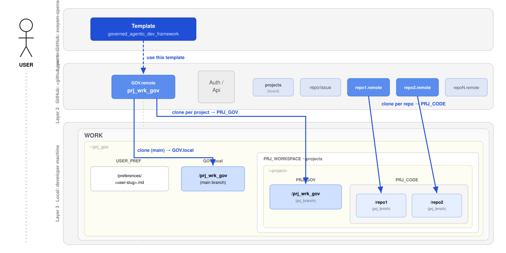

---

# Use Cases

Each use case has a **header** (frequency, actor, command, dependency, purpose)
and a **diagram**. Participants are grouped into the **same three layers** as the
topology above (`box` per layer); the **User** (Owner / Manager / Developer) is an
actor lane inside the Layer-3 box, and each Layer-3 box carries its on-disk path.

Three families:

- **Governance Initialize** (`gov.init.*`) — one-time, by the **Owner**.
- **Governance Management** (`gov.mgmt.*`) — as required, by a **Manager** (or Owner).
- **Governed Development** (`gov.dev.*`) — as required, by a **Developer**.

---

## Governance Initialize

### gov.init.1 — Create the governance repo

- **Frequency:** Once · **Actor:** Owner · **Depends on:** —
- **Runs:** GitHub "Use this template" → `git clone`
- **Purpose:** Start the governance process — create your **GOV.remote** from the
  framework template and clone it locally as **Gov.local**.

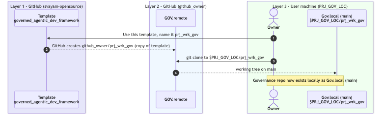

<details><summary>diagram source (Mermaid) — edit here, then re-render</summary>

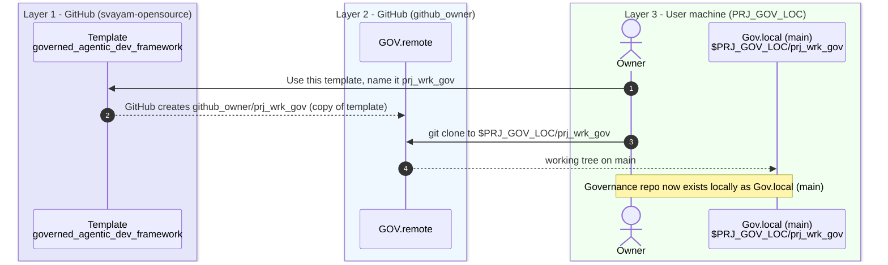
```mermaid
sequenceDiagram
    autonumber
    box Lavender Layer 1 - GitHub (svayam-opensource)
        participant TPL as Template<br/>governed_agentic_dev_framework
    end
    box AliceBlue Layer 2 - GitHub (github_owner)
        participant RG as GOV.remote
    end
    box Honeydew Layer 3 - User machine (PRJ_GOV_LOC)
        actor Owner
        participant GL as Gov.local (main)<br/>$PRJ_GOV_LOC/prj_wrk_gov
    end

    Owner->>TPL: Use this template, name it prj_wrk_gov
    TPL-->>RG: GitHub creates github_owner/prj_wrk_gov (copy of template)
    Owner->>RG: git clone to $PRJ_GOV_LOC/prj_wrk_gov
    RG-->>GL: working tree on main
    Note over Owner,GL: Governance repo now exists locally as Gov.local (main)
```

</details>

### gov.init.2 — Configure governance defaults

- **Frequency:** Once · **Actor:** Owner · **Depends on:** gov.init.1
- **Runs:** `bash scripts/install-deps.sh`, `bash setup.sh`
- **Purpose:** Establish org defaults (org-config), substitute placeholders,
  acquire the gh scopes the governance flow needs, and bootstrap the Owner's
  preferences file.

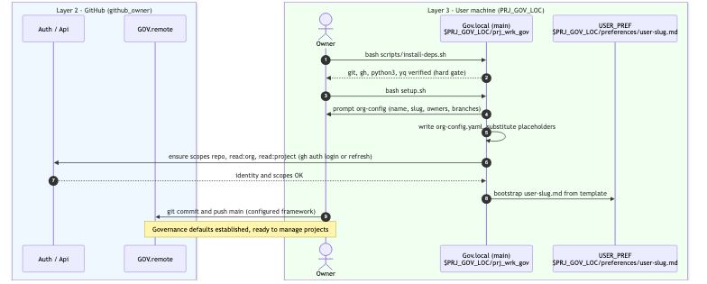

<details><summary>diagram source (Mermaid) — edit here, then re-render</summary>

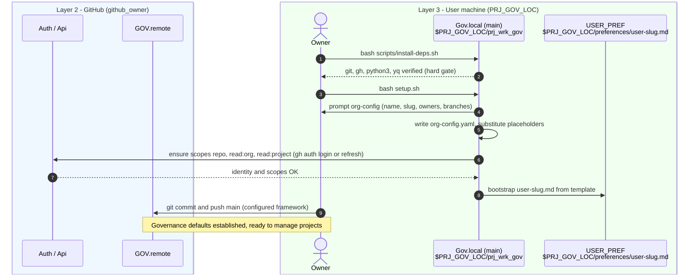
```mermaid
sequenceDiagram
    autonumber
    box AliceBlue Layer 2 - GitHub (github_owner)
        participant GH as Auth / Api
        participant RG as GOV.remote
    end
    box Honeydew Layer 3 - User machine (PRJ_GOV_LOC)
        actor Owner
        participant GL as Gov.local (main)<br/>$PRJ_GOV_LOC/prj_wrk_gov
        participant UP as USER_PREF<br/>$PRJ_GOV_LOC/preferences/user-slug.md
    end

    Owner->>GL: bash scripts/install-deps.sh
    GL-->>Owner: git, gh, python3, yq verified (hard gate)
    Owner->>GL: bash setup.sh
    GL->>Owner: prompt org-config (name, slug, owners, branches)
    GL->>GL: write org-config.yaml, substitute placeholders
    GL->>GH: ensure scopes repo, read:org, read:project (gh auth login or refresh)
    GH-->>GL: identity and scopes OK
    GL->>UP: bootstrap user-slug.md from template
    Owner->>RG: git commit and push main (configured framework)
    Note over Owner,RG: Governance defaults established, ready to manage projects
```

</details>

---

## Governance Management

All management ops run from **Gov.local** on `main`.

### gov.mgmt.1 — Assign a project to a developer

- **Frequency:** As required · **Actor:** Manager · **Depends on:** gov.init.2
- **Runs:** `./prj manage assign`
- **Purpose:** Pre-assign a GitHub Project to a developer so only they may seed it.


<details><summary>diagram source (Mermaid) — edit here, then re-render</summary>

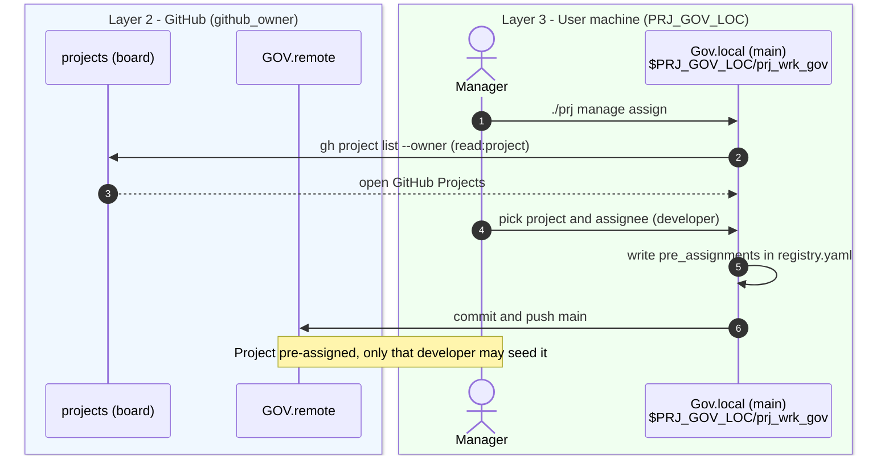
```mermaid
sequenceDiagram
    autonumber
    box AliceBlue Layer 2 - GitHub (github_owner)
        participant Board as projects (board)
        participant RG as GOV.remote
    end
    box Honeydew Layer 3 - User machine (PRJ_GOV_LOC)
        actor Mgr as Manager
        participant GL as Gov.local (main)<br/>$PRJ_GOV_LOC/prj_wrk_gov
    end

    Mgr->>GL: ./prj manage assign
    GL->>Board: gh project list --owner (read:project)
    Board-->>GL: open GitHub Projects
    Mgr->>GL: pick project and assignee (developer)
    GL->>GL: write pre_assignments in registry.yaml
    GL->>RG: commit and push main
    Note over Mgr,RG: Project pre-assigned, only that developer may seed it
```

</details>

### gov.mgmt.2 — List / inspect assignments

- **Frequency:** As required · **Actor:** Manager · **Depends on:** gov.init.2
- **Runs:** `./prj manage list`
- **Purpose:** See every GitHub Project with its seeded ID, status, and assignee.

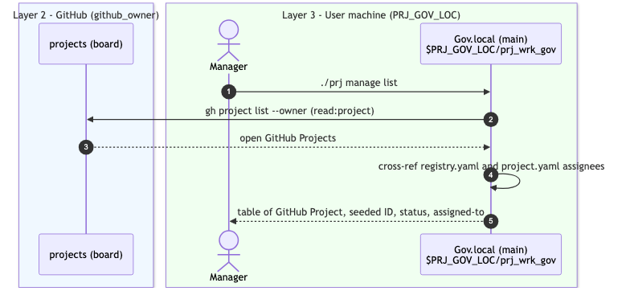

<details><summary>diagram source (Mermaid) — edit here, then re-render</summary>

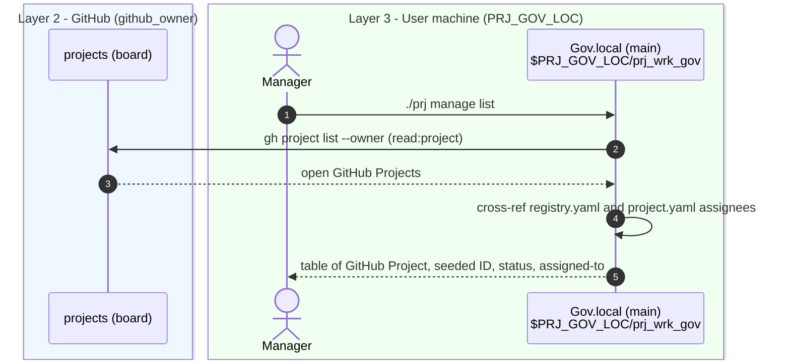
```mermaid
sequenceDiagram
    autonumber
    box AliceBlue Layer 2 - GitHub (github_owner)
        participant Board as projects (board)
    end
    box Honeydew Layer 3 - User machine (PRJ_GOV_LOC)
        actor Mgr as Manager
        participant GL as Gov.local (main)<br/>$PRJ_GOV_LOC/prj_wrk_gov
    end

    Mgr->>GL: ./prj manage list
    GL->>Board: gh project list --owner (read:project)
    Board-->>GL: open GitHub Projects
    GL->>GL: cross-ref registry.yaml and project.yaml assignees
    GL-->>Mgr: table of GitHub Project, seeded ID, status, assigned-to
```

</details>

### gov.mgmt.3 — Reassign a project (C02)

- **Frequency:** As required · **Actor:** Manager · **Depends on:** gov.mgmt.1
- **Runs:** `./prj manage reassign`
- **Purpose:** Move a project to a different developer. Requires a reason (C02).

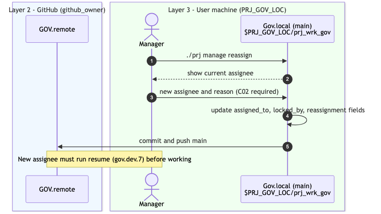

<details><summary>diagram source (Mermaid) — edit here, then re-render</summary>

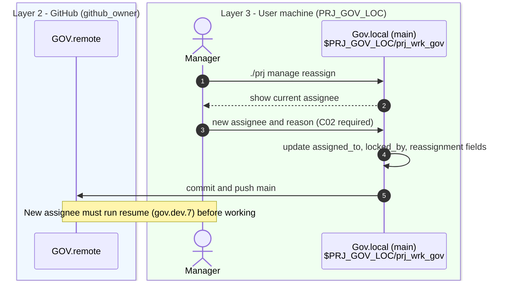
```mermaid
sequenceDiagram
    autonumber
    box AliceBlue Layer 2 - GitHub (github_owner)
        participant RG as GOV.remote
    end
    box Honeydew Layer 3 - User machine (PRJ_GOV_LOC)
        actor Mgr as Manager
        participant GL as Gov.local (main)<br/>$PRJ_GOV_LOC/prj_wrk_gov
    end

    Mgr->>GL: ./prj manage reassign
    GL-->>Mgr: show current assignee
    Mgr->>GL: new assignee and reason (C02 required)
    GL->>GL: update assigned_to, locked_by, reassignment fields
    GL->>RG: commit and push main
    Note over Mgr,RG: New assignee must run resume (gov.dev.7) before working
```

</details>

### gov.mgmt.4 — Unassign a project

- **Frequency:** As required · **Actor:** Manager · **Depends on:** gov.mgmt.1
- **Runs:** `./prj manage unassign`
- **Purpose:** Return a not-yet-seeded project to unassigned.

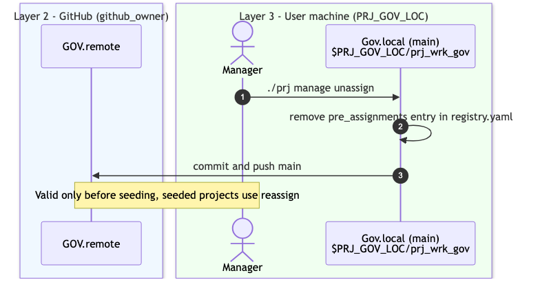

<details><summary>diagram source (Mermaid) — edit here, then re-render</summary>

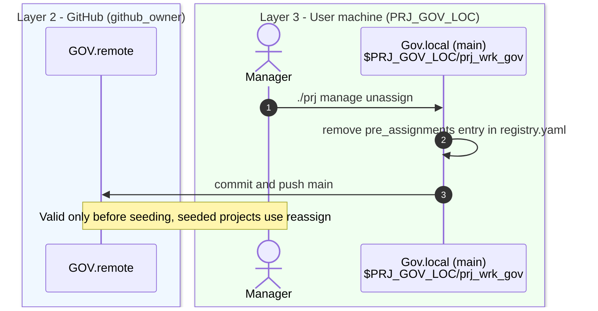
```mermaid
sequenceDiagram
    autonumber
    box AliceBlue Layer 2 - GitHub (github_owner)
        participant RG as GOV.remote
    end
    box Honeydew Layer 3 - User machine (PRJ_GOV_LOC)
        actor Mgr as Manager
        participant GL as Gov.local (main)<br/>$PRJ_GOV_LOC/prj_wrk_gov
    end

    Mgr->>GL: ./prj manage unassign
    GL->>GL: remove pre_assignments entry in registry.yaml
    GL->>RG: commit and push main
    Note over Mgr,RG: Valid only before seeding, seeded projects use reassign
```

</details>

### gov.mgmt.5 — Onboard a code repo

- **Frequency:** As required · **Actor:** Owner · **Depends on:** gov.init.2
- **Runs:** `./prj onboard <repo-url>`
- **Purpose:** Initialize the `knowledge/` structure in a code repo so it can join
  projects (POL-085). Raises a PR via CODEOWNERS.

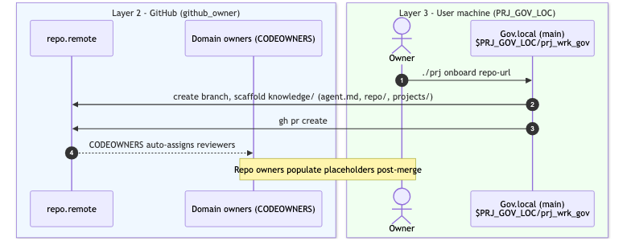

<details><summary>diagram source (Mermaid) — edit here, then re-render</summary>

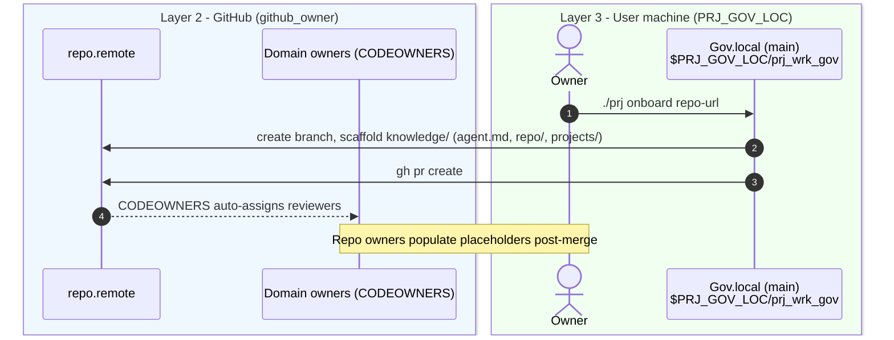
```mermaid
sequenceDiagram
    autonumber
    box AliceBlue Layer 2 - GitHub (github_owner)
        participant RC as repo.remote
        participant Owners as Domain owners (CODEOWNERS)
    end
    box Honeydew Layer 3 - User machine (PRJ_GOV_LOC)
        actor Owner
        participant GL as Gov.local (main)<br/>$PRJ_GOV_LOC/prj_wrk_gov
    end

    Owner->>GL: ./prj onboard repo-url
    GL->>RC: create branch, scaffold knowledge/ (agent.md, repo/, projects/)
    GL->>RC: gh pr create
    RC-->>Owners: CODEOWNERS auto-assigns reviewers
    Note over Owner,Owners: Repo owners populate placeholders post-merge
```

</details>

### gov.mgmt.6 — Propose org knowledge (outside any project)

- **Frequency:** As required · **Actor:** Owner · **Depends on:** gov.init.2
- **Runs:** `./prj knowledge`
- **Purpose:** Ad-hoc change to org-wide `knowledge/` not tied to a project
  (e.g. a policy update). Raises a PR via CODEOWNERS.

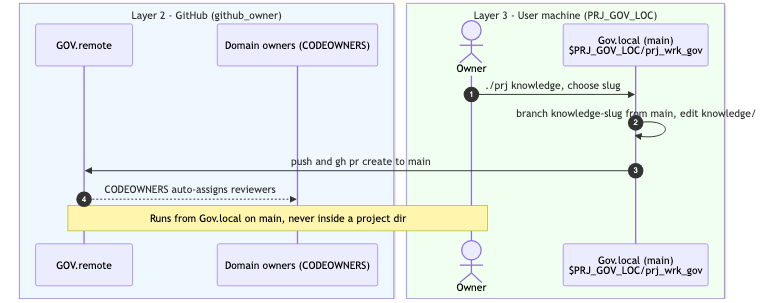

<details><summary>diagram source (Mermaid) — edit here, then re-render</summary>

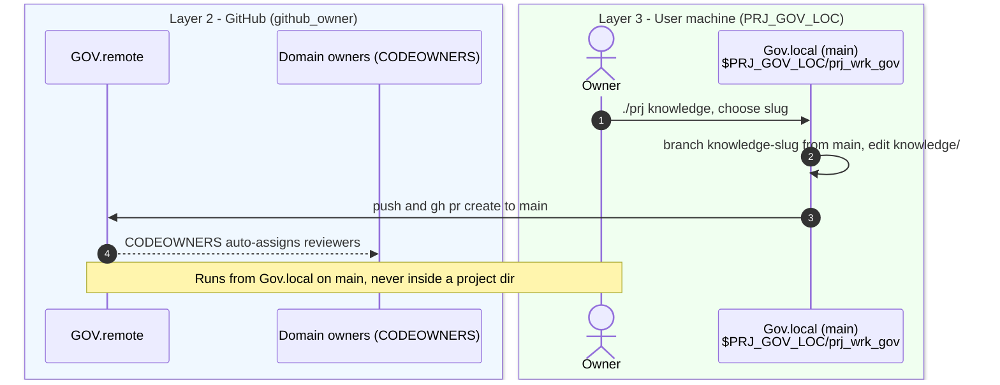
```mermaid
sequenceDiagram
    autonumber
    box AliceBlue Layer 2 - GitHub (github_owner)
        participant RG as GOV.remote
        participant Owners as Domain owners (CODEOWNERS)
    end
    box Honeydew Layer 3 - User machine (PRJ_GOV_LOC)
        actor Owner
        participant GL as Gov.local (main)<br/>$PRJ_GOV_LOC/prj_wrk_gov
    end

    Owner->>GL: ./prj knowledge, choose slug
    GL->>GL: branch knowledge-slug from main, edit knowledge/
    GL->>RG: push and gh pr create to main
    RG-->>Owners: CODEOWNERS auto-assigns reviewers
    Note over Owner,RG: Runs from Gov.local on main, never inside a project dir
```

</details>

---

## Governed Development

Listed in **lifecycle order**. (You sketched `prj close` as `gov.dev.2`; here it
lands at `gov.dev.8` — say the word to renumber.) Most ops run from **PRJ_GOV**
in the project dir.

### gov.dev.1 — Initialize the project (seed)

- **Frequency:** As required · **Actor:** Developer · **Depends on:** gov.mgmt.1
- **Runs:** `./prj init`
- **Purpose:** Allocate the immutable `NNN`, create the project branch in every
  repo, scaffold `projects/<PID>/`, and produce the per-project clones. Ends by
  asking whether to switch into the project or stay in management.

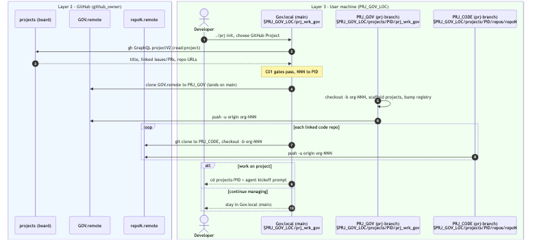

<details><summary>diagram source (Mermaid) — edit here, then re-render</summary>

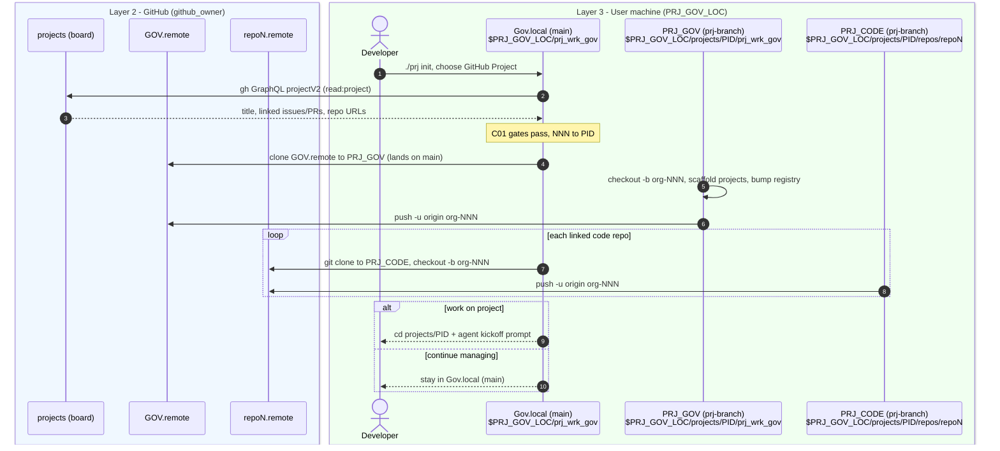
```mermaid
sequenceDiagram
    autonumber
    box AliceBlue Layer 2 - GitHub (github_owner)
        participant Board as projects (board)
        participant RG as GOV.remote
        participant RC as repoN.remote
    end
    box Honeydew Layer 3 - User machine (PRJ_GOV_LOC)
        actor Dev as Developer
        participant GL as Gov.local (main)<br/>$PRJ_GOV_LOC/prj_wrk_gov
        participant PG as PRJ_GOV (prj-branch)<br/>$PRJ_GOV_LOC/projects/PID/prj_wrk_gov
        participant CODE as PRJ_CODE (prj-branch)<br/>$PRJ_GOV_LOC/projects/PID/repos/repoN
    end

    Dev->>GL: ./prj init, choose GitHub Project
    GL->>Board: gh GraphQL projectV2 (read:project)
    Board-->>GL: title, linked issues/PRs, repo URLs
    Note over GL: C01 gates pass, NNN to PID
    GL->>RG: clone GOV.remote to PRJ_GOV (lands on main)
    PG->>PG: checkout -b org-NNN, scaffold projects, bump registry
    PG->>RG: push -u origin org-NNN
    loop each linked code repo
        GL->>RC: git clone to PRJ_CODE, checkout -b org-NNN
        CODE->>RC: push -u origin org-NNN
    end
    alt work on project
        GL-->>Dev: cd projects/PID + agent kickoff prompt
    else continue managing
        GL-->>Dev: stay in Gov.local (main)
    end
```

</details>

### gov.dev.2 — Work a session (load + work + capture)

- **Frequency:** Each session · **Actor:** Developer · **Depends on:** gov.dev.1
- **Runs:** the C01 session-start protocol, then work
- **Purpose:** Load the four knowledge layers fresh, do the work in PRJ_CODE,
  capture decisions/to-dos in PRJ_GOV, and push.

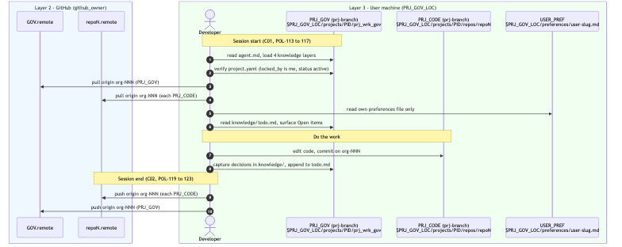

<details><summary>diagram source (Mermaid) — edit here, then re-render</summary>

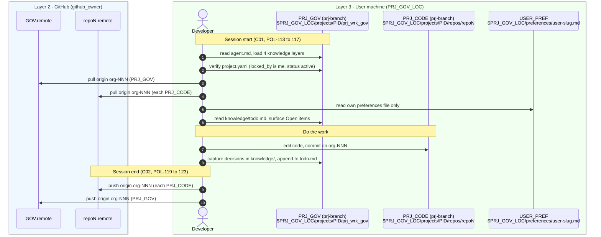
```mermaid
sequenceDiagram
    autonumber
    box AliceBlue Layer 2 - GitHub (github_owner)
        participant RG as GOV.remote
        participant RC as repoN.remote
    end
    box Honeydew Layer 3 - User machine (PRJ_GOV_LOC)
        actor Dev as Developer
        participant PG as PRJ_GOV (prj-branch)<br/>$PRJ_GOV_LOC/projects/PID/prj_wrk_gov
        participant CODE as PRJ_CODE (prj-branch)<br/>$PRJ_GOV_LOC/projects/PID/repos/repoN
        participant UP as USER_PREF<br/>$PRJ_GOV_LOC/preferences/user-slug.md
    end

    Note over Dev,PG: Session start (C01, POL-113 to 117)
    Dev->>PG: read agent.md, load 4 knowledge layers
    Dev->>PG: verify project.yaml (locked_by is me, status active)
    Dev->>RG: pull origin org-NNN (PRJ_GOV)
    Dev->>RC: pull origin org-NNN (each PRJ_CODE)
    Dev->>UP: read own preferences file only
    Dev->>PG: read knowledge/todo.md, surface Open items
    Note over Dev,CODE: Do the work
    Dev->>CODE: edit code, commit on org-NNN
    Dev->>PG: capture decisions in knowledge/, append to todo.md
    Note over Dev,RC: Session end (C02, POL-119 to 123)
    Dev->>RC: push origin org-NNN (each PRJ_CODE)
    Dev->>RG: push origin org-NNN (PRJ_GOV)
```

</details>

### gov.dev.3 — Create a task sub-branch

- **Frequency:** As required · **Actor:** Developer · **Depends on:** gov.dev.1
- **Runs:** `./prj task <issue-url>`
- **Purpose:** Carve a parallel unit of work (one assignee, POL-074) as a
  sub-branch in the gov + all code repos, linked to a GitHub Issue.

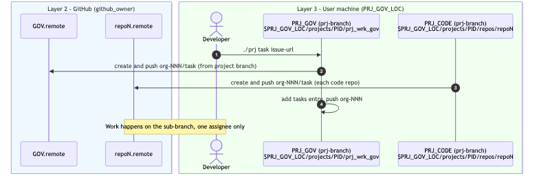

<details><summary>diagram source (Mermaid) — edit here, then re-render</summary>

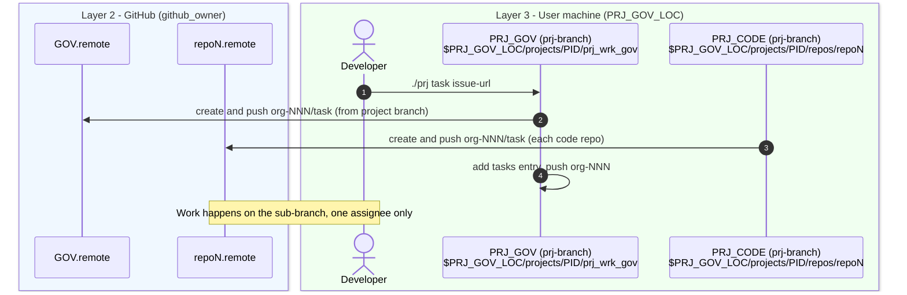
```mermaid
sequenceDiagram
    autonumber
    box AliceBlue Layer 2 - GitHub (github_owner)
        participant RG as GOV.remote
        participant RC as repoN.remote
    end
    box Honeydew Layer 3 - User machine (PRJ_GOV_LOC)
        actor Dev as Developer
        participant PG as PRJ_GOV (prj-branch)<br/>$PRJ_GOV_LOC/projects/PID/prj_wrk_gov
        participant CODE as PRJ_CODE (prj-branch)<br/>$PRJ_GOV_LOC/projects/PID/repos/repoN
    end

    Dev->>PG: ./prj task issue-url
    PG->>RG: create and push org-NNN/task (from project branch)
    CODE->>RC: create and push org-NNN/task (each code repo)
    PG->>PG: add tasks entry, push org-NNN
    Note over Dev,RC: Work happens on the sub-branch, one assignee only
```

</details>

### gov.dev.4 — Merge a task back

- **Frequency:** As required · **Actor:** Developer · **Depends on:** gov.dev.3
- **Runs:** `./prj merge`
- **Purpose:** Merge a finished sub-branch into the **project branch only**
  (never main/base, POL-073), archive it, and close the issue.

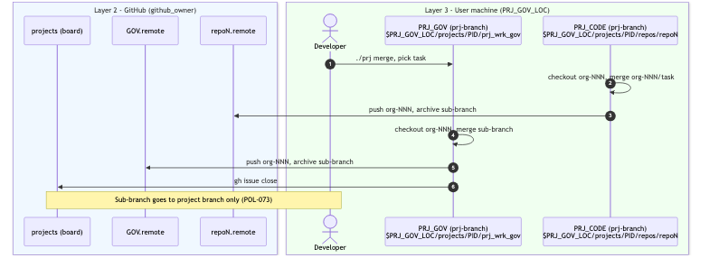

<details><summary>diagram source (Mermaid) — edit here, then re-render</summary>

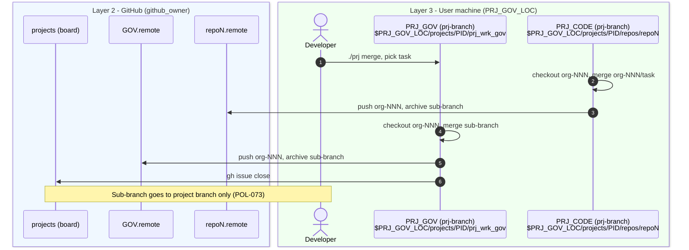
```mermaid
sequenceDiagram
    autonumber
    box AliceBlue Layer 2 - GitHub (github_owner)
        participant Board as projects (board)
        participant RG as GOV.remote
        participant RC as repoN.remote
    end
    box Honeydew Layer 3 - User machine (PRJ_GOV_LOC)
        actor Dev as Developer
        participant PG as PRJ_GOV (prj-branch)<br/>$PRJ_GOV_LOC/projects/PID/prj_wrk_gov
        participant CODE as PRJ_CODE (prj-branch)<br/>$PRJ_GOV_LOC/projects/PID/repos/repoN
    end

    Dev->>PG: ./prj merge, pick task
    CODE->>CODE: checkout org-NNN, merge org-NNN/task
    CODE->>RC: push org-NNN, archive sub-branch
    PG->>PG: checkout org-NNN, merge sub-branch
    PG->>RG: push org-NNN, archive sub-branch
    PG->>Board: gh issue close
    Note over Dev,Board: Sub-branch goes to project branch only (POL-073)
```

</details>

### gov.dev.5 — Sync from main

- **Frequency:** As required · **Actor:** Developer · **Depends on:** gov.dev.1
- **Runs:** `./prj sync`
- **Purpose:** Pull policy/knowledge updates that landed on `main` (and base
  branches) into the project branch, without changing status.

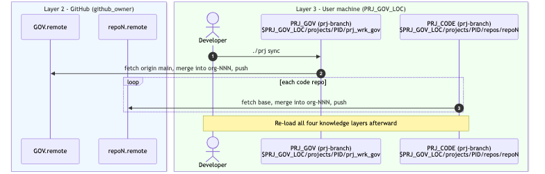

<details><summary>diagram source (Mermaid) — edit here, then re-render</summary>

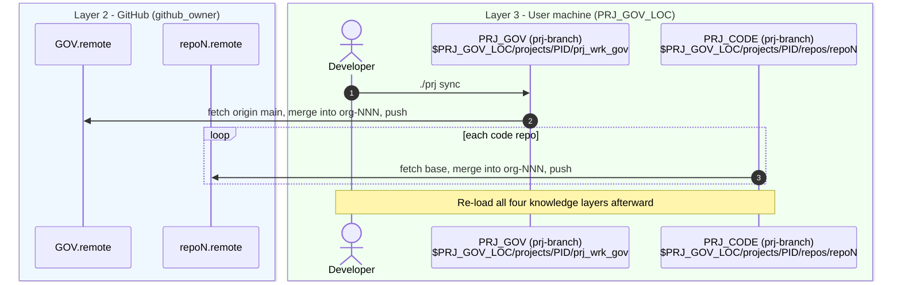
```mermaid
sequenceDiagram
    autonumber
    box AliceBlue Layer 2 - GitHub (github_owner)
        participant RG as GOV.remote
        participant RC as repoN.remote
    end
    box Honeydew Layer 3 - User machine (PRJ_GOV_LOC)
        actor Dev as Developer
        participant PG as PRJ_GOV (prj-branch)<br/>$PRJ_GOV_LOC/projects/PID/prj_wrk_gov
        participant CODE as PRJ_CODE (prj-branch)<br/>$PRJ_GOV_LOC/projects/PID/repos/repoN
    end

    Dev->>PG: ./prj sync
    PG->>RG: fetch origin main, merge into org-NNN, push
    loop each code repo
        CODE->>RC: fetch base, merge into org-NNN, push
    end
    Note over Dev,CODE: Re-load all four knowledge layers afterward
```

</details>

### gov.dev.6 — Pause the project

- **Frequency:** As required · **Actor:** Developer · **Depends on:** gov.dev.1
- **Runs:** `./prj pause`
- **Purpose:** Commit/push pending work and mark the project `paused`. Assignee
  unchanged.

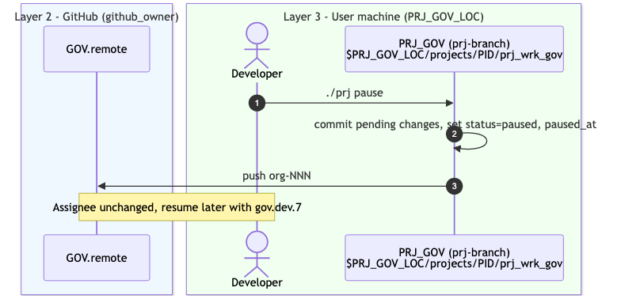

<details><summary>diagram source (Mermaid) — edit here, then re-render</summary>

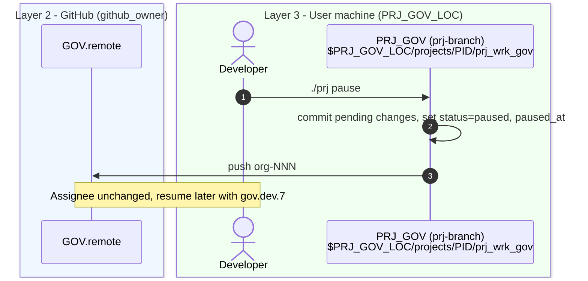
```mermaid
sequenceDiagram
    autonumber
    box AliceBlue Layer 2 - GitHub (github_owner)
        participant RG as GOV.remote
    end
    box Honeydew Layer 3 - User machine (PRJ_GOV_LOC)
        actor Dev as Developer
        participant PG as PRJ_GOV (prj-branch)<br/>$PRJ_GOV_LOC/projects/PID/prj_wrk_gov
    end

    Dev->>PG: ./prj pause
    PG->>PG: commit pending changes, set status=paused, paused_at
    PG->>RG: push org-NNN
    Note over Dev,RG: Assignee unchanged, resume later with gov.dev.7
```

</details>

### gov.dev.7 — Resume the project

- **Frequency:** As required · **Actor:** Developer · **Depends on:** gov.dev.6
- **Runs:** `./prj resume`
- **Purpose:** Flip `paused → active` and run a mandatory sync of main + base
  branches into the project branch.

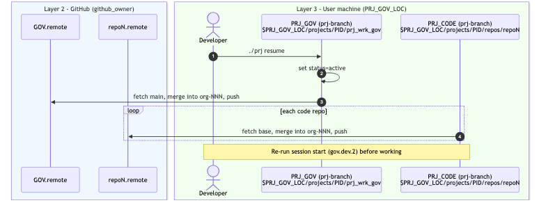

<details><summary>diagram source (Mermaid) — edit here, then re-render</summary>

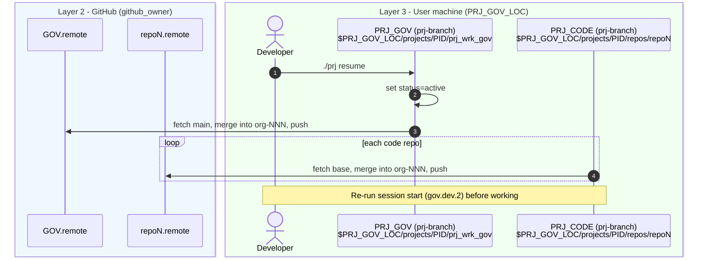
```mermaid
sequenceDiagram
    autonumber
    box AliceBlue Layer 2 - GitHub (github_owner)
        participant RG as GOV.remote
        participant RC as repoN.remote
    end
    box Honeydew Layer 3 - User machine (PRJ_GOV_LOC)
        actor Dev as Developer
        participant PG as PRJ_GOV (prj-branch)<br/>$PRJ_GOV_LOC/projects/PID/prj_wrk_gov
        participant CODE as PRJ_CODE (prj-branch)<br/>$PRJ_GOV_LOC/projects/PID/repos/repoN
    end

    Dev->>PG: ./prj resume
    PG->>PG: set status=active
    PG->>RG: fetch main, merge into org-NNN, push
    loop each code repo
        CODE->>RC: fetch base, merge into org-NNN, push
    end
    Note over Dev,CODE: Re-run session start (gov.dev.2) before working
```

</details>

### gov.dev.8 — Close the project

- **Frequency:** Once per project · **Actor:** Developer · **Depends on:** gov.dev.1 (+ all tasks merged)
- **Runs:** `./prj close`
- **Purpose:** Merge the project branch to each code base, promote to `main` via
  the test-merge gate, archive branches, and auto-fire knowledge close.

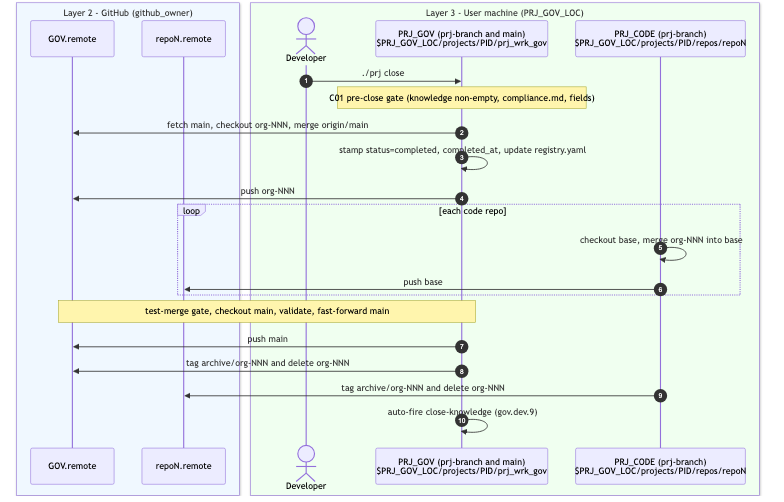

<details><summary>diagram source (Mermaid) — edit here, then re-render</summary>

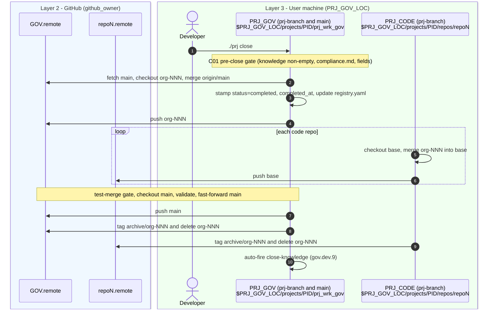
```mermaid
sequenceDiagram
    autonumber
    box AliceBlue Layer 2 - GitHub (github_owner)
        participant RG as GOV.remote
        participant RC as repoN.remote
    end
    box Honeydew Layer 3 - User machine (PRJ_GOV_LOC)
        actor Dev as Developer
        participant PG as PRJ_GOV (prj-branch and main)<br/>$PRJ_GOV_LOC/projects/PID/prj_wrk_gov
        participant CODE as PRJ_CODE (prj-branch)<br/>$PRJ_GOV_LOC/projects/PID/repos/repoN
    end

    Dev->>PG: ./prj close
    Note over PG: C01 pre-close gate (knowledge non-empty, compliance.md, fields)
    PG->>RG: fetch main, checkout org-NNN, merge origin/main
    PG->>PG: stamp status=completed, completed_at, update registry.yaml
    PG->>RG: push org-NNN
    loop each code repo
        CODE->>CODE: checkout base, merge org-NNN into base
        CODE->>RC: push base
    end
    Note over PG,RG: test-merge gate, checkout main, validate, fast-forward main
    PG->>RG: push main
    PG->>RG: tag archive/org-NNN and delete org-NNN
    CODE->>RC: tag archive/org-NNN and delete org-NNN
    PG->>PG: auto-fire close-knowledge (gov.dev.9)
```

</details>

### gov.dev.9 — Knowledge close (auto-fired)

- **Frequency:** Auto, after gov.dev.8 · **Actor:** Developer (agent-assisted) · **Depends on:** gov.dev.8
- **Runs:** `close-knowledge.sh` (auto-fired)
- **Purpose:** A pure `main`-rooted op — branch from `main`, synthesize project
  learnings into org `knowledge/`, and PR back to `main`.

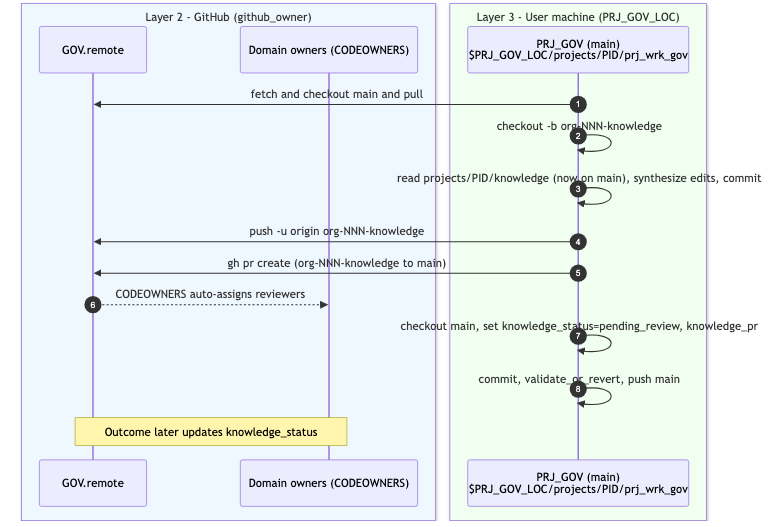

<details><summary>diagram source (Mermaid) — edit here, then re-render</summary>

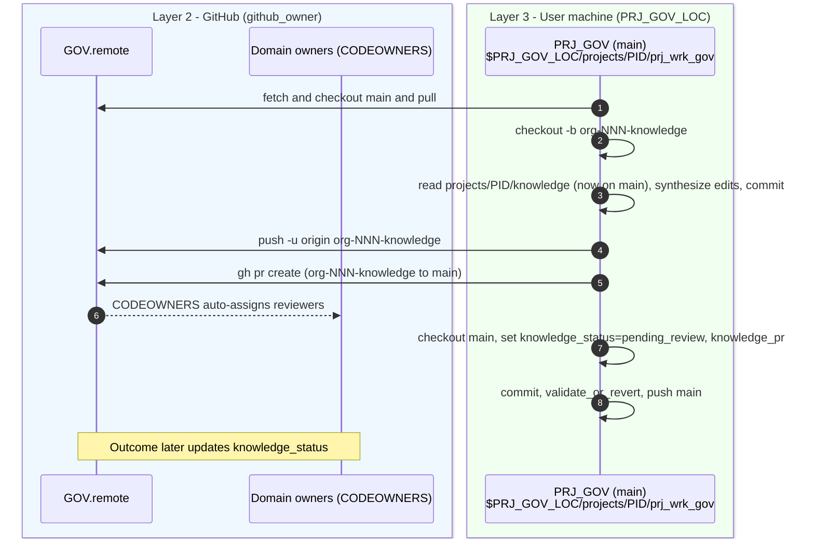
```mermaid
sequenceDiagram
    autonumber
    box AliceBlue Layer 2 - GitHub (github_owner)
        participant RG as GOV.remote
        participant Owners as Domain owners (CODEOWNERS)
    end
    box Honeydew Layer 3 - User machine (PRJ_GOV_LOC)
        participant PG as PRJ_GOV (main)<br/>$PRJ_GOV_LOC/projects/PID/prj_wrk_gov
    end

    PG->>RG: fetch and checkout main and pull
    PG->>PG: checkout -b org-NNN-knowledge
    PG->>PG: read projects/PID/knowledge (now on main), synthesize edits, commit
    PG->>RG: push -u origin org-NNN-knowledge
    PG->>RG: gh pr create (org-NNN-knowledge to main)
    RG-->>Owners: CODEOWNERS auto-assigns reviewers
    PG->>PG: checkout main, set knowledge_status=pending_review, knowledge_pr
    PG->>PG: commit, validate_or_revert, push main
    Note over RG,Owners: Outcome later updates knowledge_status
```

</details>

### gov.dev.10 — Cancel the project

- **Frequency:** As required · **Actor:** Developer · **Depends on:** gov.dev.1
- **Runs:** `./prj cancel "<reason>"`
- **Purpose:** Abandon a project. Branches are archived but **not merged**; no
  knowledge close. Reason is required (C01).

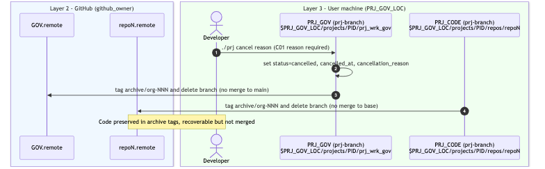

<details><summary>diagram source (Mermaid) — edit here, then re-render</summary>

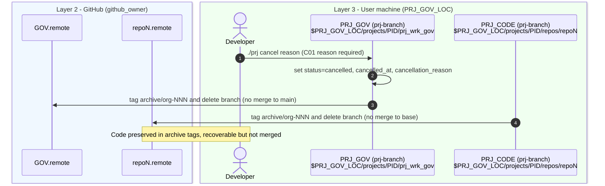
```mermaid
sequenceDiagram
    autonumber
    box AliceBlue Layer 2 - GitHub (github_owner)
        participant RG as GOV.remote
        participant RC as repoN.remote
    end
    box Honeydew Layer 3 - User machine (PRJ_GOV_LOC)
        actor Dev as Developer
        participant PG as PRJ_GOV (prj-branch)<br/>$PRJ_GOV_LOC/projects/PID/prj_wrk_gov
        participant CODE as PRJ_CODE (prj-branch)<br/>$PRJ_GOV_LOC/projects/PID/repos/repoN
    end

    Dev->>PG: ./prj cancel reason (C01 reason required)
    PG->>PG: set status=cancelled, cancelled_at, cancellation_reason
    PG->>RG: tag archive/org-NNN and delete branch (no merge to main)
    CODE->>RC: tag archive/org-NNN and delete branch (no merge to base)
    Note over Dev,RC: Code preserved in archive tags, recoverable but not merged
```

</details>

### gov.dev.11 — Join an existing project (PROPOSED — multi-dev, #5)

- **Frequency:** As required · **Actor:** Developer (teammate) · **Depends on:** gov.dev.1 (by another dev)
- **Runs:** `./prj join ORG-007-foo` *(proposed command)*
- **Purpose:** Let a second authorized developer set up their **own** PRJ_GOV +
  PRJ_CODE clones on the existing project branch — no new `NNN`, no change to
  `locked_by`.

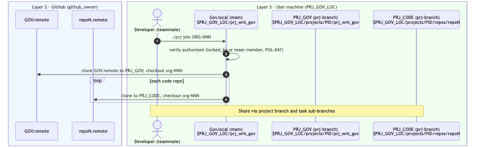

<details><summary>diagram source (Mermaid) — edit here, then re-render</summary>

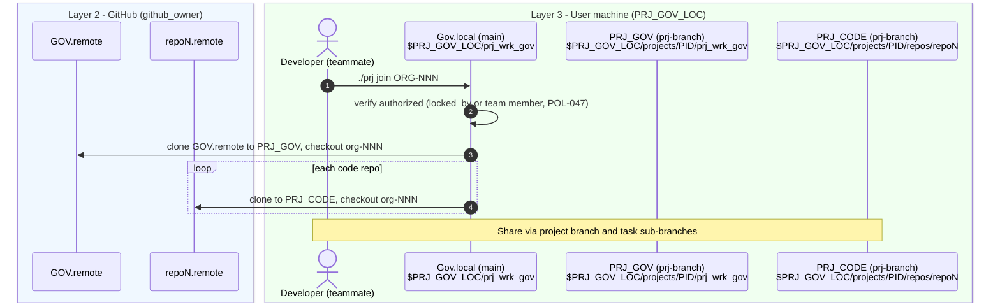
```mermaid
sequenceDiagram
    autonumber
    box AliceBlue Layer 2 - GitHub (github_owner)
        participant RG as GOV.remote
        participant RC as repoN.remote
    end
    box Honeydew Layer 3 - User machine (PRJ_GOV_LOC)
        actor Dev2 as Developer (teammate)
        participant GL as Gov.local (main)<br/>$PRJ_GOV_LOC/prj_wrk_gov
        participant PG as PRJ_GOV (prj-branch)<br/>$PRJ_GOV_LOC/projects/PID/prj_wrk_gov
        participant CODE as PRJ_CODE (prj-branch)<br/>$PRJ_GOV_LOC/projects/PID/repos/repoN
    end

    Dev2->>GL: ./prj join ORG-NNN
    GL->>GL: verify authorized (locked_by or team member, POL-047)
    GL->>RG: clone GOV.remote to PRJ_GOV, checkout org-NNN
    loop each code repo
        GL->>RC: clone to PRJ_CODE, checkout org-NNN
    end
    Note over Dev2,CODE: Share via project branch and task sub-branches
```

</details>

---

## What Option 2 assumes / costs (read before committing to it)

- **Two gov clones:** **Gov.local** (`$PRJ_GOV_LOC/prj_wrk_gov`, where management
  ops run from `main`) and one **PRJ_GOV** per project (on the project branch,
  for `task`/`merge`/`sync`/`close`).
- **Each PRJ_GOV carries its own `main`** — `close`, the test-merge gate, and
  `close-knowledge` all `git fetch origin main` on demand, so a stale local
  `main` is harmless (always re-fetched). Gov.local's local `main` likewise needs
  a `git pull` after a project closes elsewhere.
- **No worktree constraints** — unlike Option 1, nothing forbids checking out
  `main` in PRJ_GOV, because each clone is independent.
- **`propose-knowledge` (gov.mgmt.6)** runs from **Gov.local** on `main`; it is
  not part of any per-project dir.
- **Multi-developer (#5):** handled by **gov.dev.11** (`prj join`) — teammates
  get their own clones on the project branch without re-seeding or changing
  `locked_by`; `close` is run once after all sub-branches merge.
- **Developer preferences (USER_PREF):** `$PRJ_GOV_LOC/preferences/<github-user-slug>.md`
  — one file per developer (lowest knowledge layer, POL-080/127); you read only
  your own. A top-level sibling of `projects/`, since prefs span all projects.
