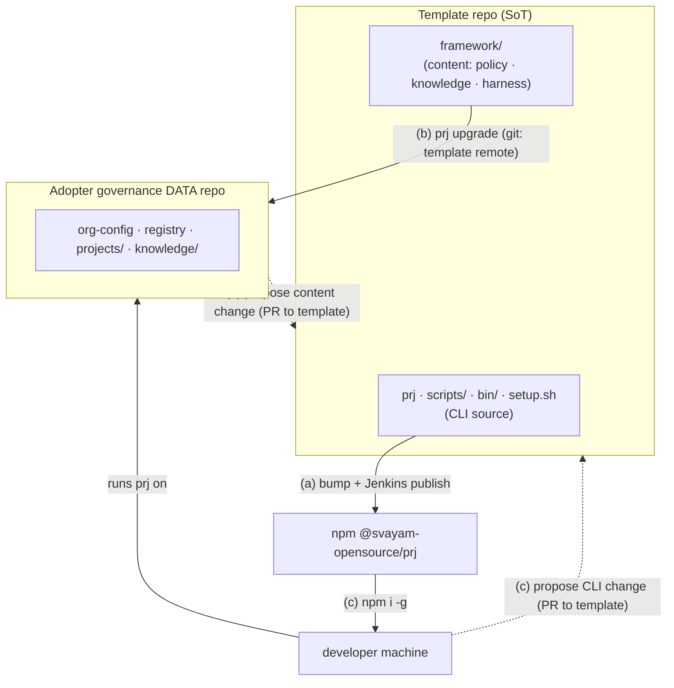

# Operating model — who does what

The framework is **two artifacts** produced from **one source repo**:

- **This template repo** (`svayam-opensource/governed-agentic-dev-framework`) — the
  **source of truth** for *both* the `prj` **CLI** (repo root: `prj`, `scripts/`,
  `bin/`, `setup.sh`) and the **content** (`framework/`: policies, knowledge
  starters, the agent harness/protocol, the install `MANIFEST`).
- **npm `@svayam-opensource/prj`** — the **published CLI**, built from this repo.
- **Adopter governance repos** (e.g. `Svayamtech/svm-prj-work`) — pure governance
  **data** (org-config, registry, `projects/`, `knowledge/`). They **consume** the
  CLI from npm and the content from this template; they hold **no** CLI source.

---

## (a) Framework maintainer / contributor

*You work **in this template repo**. You change the product; everyone else consumes it.*

| Goal | Path |
|---|---|
| **Update content** | Edit under `framework/` (policies, knowledge starters, harness). If you changed the **session protocol** (`agent/session-protocol.md`), re-render the per-tool harness files: `bash scripts/render-harness.sh` (the generated `framework/CLAUDE.md`, `.cursor/…` etc. carry a "do not edit" banner — edit the source + re-render). |
| **Publish content** | Open a PR → merge to `main`. Merging **is** the content release: adopters pick it up with `prj upgrade` (which pulls `framework/` from this repo's `main`). No separate step. |
| **Update the CLI** | Edit at the repo root: `prj`, `scripts/`, `bin/`, `setup.sh`. |
| **Publish the CLI to npmjs** | `scripts/bump-version.sh <x.y.z>` (keeps `package.json` == `framework/VERSION` == `.framework-version` in sync; `check_version_sync` enforces it), commit, push `main`, then run the Jenkins **`prj-publish`** job (`DEPLOY_ENV=prod` → npm dist-tag `latest`). The gate runs syntax + `prj validate`'s version-sync + `npm pack`; verify the new version is live on npmjs afterward. |

> Content and CLI live in the same repo — a release can carry either or both. Keep
> them coherent: a content change that needs new CLI behaviour ships with a CLI bump.

---

## (b) Governance-repo admin / user (an adopting org)

*You run your org's governance **data** repo. You pull framework updates and feed changes back.*

| Goal | Path |
|---|---|
| **Upgrade content** | `prj upgrade` — fetches the latest `framework/` from the `template` remote, applies the `MANIFEST` (3-way merge that **preserves your `org-config.yaml` and customizations**), and leaves the changes staged for you to review (`git diff`) and commit. Pin a version with `prj upgrade <tag>`; default is the template's `main`. |
| **Propose a content change** | • **Org-local** knowledge/policy (lives only in your repo): `prj knowledge` (opens a proposal branch → PR within your repo, reviewed by the relevant Owner). • **Framework-level** content (should benefit *all* adopters): open a PR against this template repo's `framework/`. Once merged + released, you receive it via `prj upgrade`. |

---

## (c) Developer using a governance repo

*You use `prj` to do governed work. You never vendor the CLI — it comes from npm.*

| Goal | Path |
|---|---|
| **Install the CLI** | `npm i -g @svayam-opensource/prj`. Runtime prereqs (not npm deps — `prj` is bash): `bash`, `git`, `gh` (authenticated), `yq`, `python3`. On Windows use **Git Bash**. |
| **Upgrade the CLI** | `npm i -g @svayam-opensource/prj@latest` (or `npm update -g @svayam-opensource/prj`). |
| **Use it** | Run `prj` and follow the menus — see the README "Journeys" (start work, take a task, finish, etc.). |
| **Propose a CLI change** | Open an issue or PR against **this template repo** (the CLI's source of truth). Don't edit an installed copy — your change must land here to ship via npm to everyone. |

---

### One-line summary

- **(a) maintainers** edit + publish the product (content → merge `main`; CLI → bump + Jenkins → npm).
- **(b) admins** `prj upgrade` to pull content; propose via `prj knowledge` (local) or a template PR (framework-wide).
- **(c) developers** `npm i -g` the CLI; propose CLI changes via a template PR.
