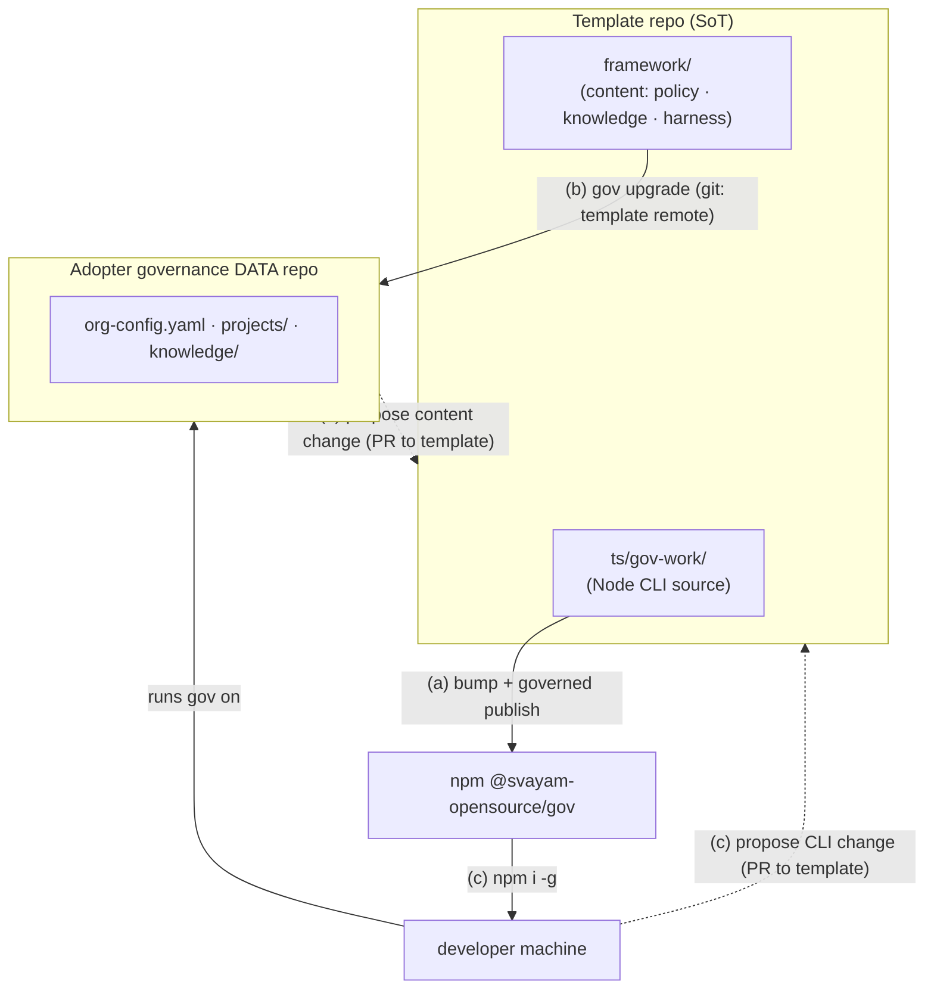

# Operating model — who does what

The framework is **two artifacts** produced from **one source repo**:

- **This template repo** (`svayam-opensource/governed-agentic-dev-framework`) — the
  **source of truth** for *both* the `gov` **CLI** (Node/TypeScript, at
  `ts/gov-work/`) and the **content** (`framework/`: policies, knowledge starters,
  the agent harness/protocol, the install `MANIFEST`).
- **npm `@svayam-opensource/gov`** — the **published CLI** (command `gov`), built
  from `ts/gov-work/`. It succeeds the legacy bash `@svayam-opensource/prj`, which
  is **frozen** at `0.10.0` (no new versions).
- **Adopter governance repos** (e.g. `Svayamtech/svm-prj-work`) — pure governance
  **data** (`org-config.yaml`, `projects/`, `knowledge/`). They **consume** the CLI
  from npm and the content from this template; they hold **no** CLI source. Under
  the GitHub-source-of-truth model there is **no `registry.yaml`** — project state
  is derived live from GitHub.

---

## (a) Framework maintainer / contributor

*You work **in this template repo**. You change the product; everyone else consumes it.*

| Goal | Path |
|---|---|
| **Update content** | Edit under `framework/` (policies, knowledge starters, harness). If you changed the **session protocol** (`agent/session-protocol.md`), re-render the per-tool harness files (the generated `framework/CLAUDE.md`, `.cursor/…` etc. carry a "do not edit" banner — edit the source + re-render). |
| **Publish content** | Open a PR → merge to `main`. Merging **is** the content release: adopters pick it up with `gov upgrade`. No separate step. |
| **Update the CLI** | Edit at `ts/gov-work/` (Node 24 / TypeScript). `npm test` (incl. the full-flow e2e gate) must pass — it's a required check on `main`. |
| **Publish the CLI to npmjs** | `gov bump-version <x.y.z>` (keeps `package.json` == `framework/VERSION` == `.framework-version` in sync; `gov validate` enforces it), commit, push `main`, then run the governed publish pipeline (`@svayam-opensource/gov`, dist-tag `latest`). The gate runs build + lint + test + version-sync + `npm pack`; verify the new version is live on npmjs afterward. |

> Content and CLI live in the same repo — a release can carry either or both. Keep
> them coherent: a content change that needs new CLI behaviour ships with a CLI bump.

---

## (b) Governance-repo admin / user (an adopting org)

*You run your org's governance **data** repo. You stand it up once, then pull framework updates and feed changes back.*

### Adopt — one-time, for a brand-new org

1. **Install the CLI:** `npm i -g @svayam-opensource/gov` (prereqs: **Node ≥ 24**,
   `git`, `gh` authenticated — no bash/yq/python needed).
2. **Create your org's governance repo** on GitHub (empty) — this becomes your
   governance **data** workspace. It holds *no* CLI source.
3. **Bootstrap:** clone the framework content into it, then run **`gov setup`** — it
   prompts for your org identity and writes **`org-config.yaml`** (org identity,
   default branches, owners), and points `origin` at your org repo.
4. **Register the workspace:** `gov org add <github_org> <gov-home-path>` then
   `gov org use <github_org>` (records the gov home so `gov` resolves it in any shell).
5. **Commit + push** to your org repo, then **start working:** `gov seed <board-url>`.

### Day-to-day

| Goal | Path |
|---|---|
| **Upgrade content** | `gov upgrade` — pulls the latest `framework/` from the `template` remote (3-way merge preserving your `org-config.yaml` + customizations). *(The Node CLI currently reports the upgrade target/command; the full overlay content-sync is on the roadmap.)* |
| **Propose a content change** | • **Org-local** knowledge/policy: `gov knowledge propose <slug>` (opens a proposal branch → PR within your repo, reviewed by the relevant Owner). • **Framework-level** content (benefits *all* adopters): open a PR against this template repo's `framework/`. Once merged + released, you receive it via `gov upgrade`. |

---

## (c) Developer using a governance repo

*You use `gov` to do governed work. You never vendor the CLI — it comes from npm.*

| Goal | Path |
|---|---|
| **Install the CLI** | `npm i -g @svayam-opensource/gov`. Runtime prereqs: **Node ≥ 24**, `git`, `gh` (authenticated). Cross-platform (no Git Bash requirement). |
| **Upgrade the CLI** | `npm i -g @svayam-opensource/gov@latest` (or `npm update -g @svayam-opensource/gov`). |
| **Use it** | Run `gov` for the interactive menu, or `gov <command>` directly — see the README. |
| **Propose a CLI change** | Open an issue or PR against **this template repo** (the CLI's source of truth, `ts/gov-work/`). Don't edit an installed copy — your change must land here to ship via npm to everyone. |

---

### One-line summary

- **(a) maintainers** edit + publish the product (content → merge `main`; CLI → `gov bump-version` + governed publish → npm).
- **(b) admins** adopt once (`gov setup` + `gov org add/use`), then `gov upgrade` to pull content; propose via `gov knowledge` (local) or a template PR (framework-wide).
- **(c) developers** `npm i -g @svayam-opensource/gov`; propose CLI changes via a template PR.

---

See also: **[session-start-protocol.md](session-start-protocol.md)** — what runs at
the start of every agent session, the three enforcement layers, and how a
governance admin customizes it.
