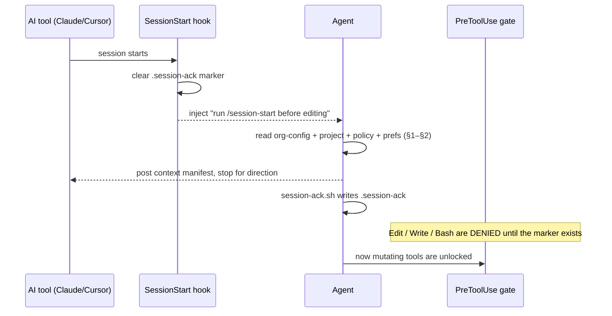

# The session-start protocol

Every new agent session — a fresh `claude` run, a new Cursor chat, or anything
after `/clear` — must, **before changing any code**: load the governance context,
post a **context manifest**, and stop for direction. The agent has to *prove* it
read `org-config.yaml`, the active project, and the policy before it acts. This is
the "agent speaks first" / **C01** rule.

## What runs

The `/session-start` steps the agent performs:
1. **Load context** — `org-config.yaml` (org), the active project's `agent.md` +
   `knowledge/todo.md` (`## Open` items), `knowledge/policies/agentic-development-policy.md`,
   and the developer's prefs.
2. **Post the context manifest** (Project · Branch · Status · Repos · Open todos ·
   Layers loaded · Awaiting) and stop for direction.
3. **Acknowledge** (`session-ack.sh`) — the last step; it writes the marker that
   unlocks `Edit`/`Write`/`Bash` for the session.

## How it's enforced — three layers

- **Layer 1 — protocol-integrity gate (CI).** `render-harness --check` /
  `check_protocol` verifies the protocol body and its rendered per-tool copies are
  in sync, so the rules an agent loads can't silently drift.
- **Layer 2 — client gates (Claude + Cursor).** `.claude/hooks/` (SessionStart
  clears the marker + reminds; PreToolUse **denies** `Edit/Write/Bash` until
  acknowledged) and `.cursor/hooks.json` (sessionStart, preToolUse deny,
  beforeShellExecution). Both **fail open** — a misconfigured hook never bricks the
  workspace.
- **Layer 3 — IAM-attested server gate.** Planned; enforces the same at the server
  side, independent of the client. Depends on the IAM service.

## Single source → rendered copies

The protocol body is single-sourced at **`agent/session-protocol.md`** and rendered
to each tool's conventional rules file (`CLAUDE.md`, `.cursor/rules/agent.mdc`,
`AGENTS.md`, `.clinerules/agent.md`, …) by `agent/render-harness.mjs`. Edit the
source and re-render — the generated files carry a "do not edit" banner.

## How a governance admin customizes session-start

What you can change, where, and whether it survives a `prj upgrade`:

| You want to… | Where | Upgrade-safe? |
|---|---|---|
| Change **what context** the agent loads/considers | add to your `knowledge/` + `knowledge/policies/` — the protocol's §2 loads the org knowledge layer into every session | ✅ org-owned, untouched |
| **Gate different tools**, or enable/disable the gate | `.claude/settings.json` (the `PreToolUse` matcher; add/remove hooks) and `.cursor/hooks.json` | ✅ `scaffold-prompt` — 3-way merge keeps your edits |
| A **per-developer** local override | `.claude/settings.local.json` (gitignored) | ✅ local only |
| Change the **gate logic** (the hook scripts) | `.claude/hooks/*`, `.cursor/hooks/*` — **framework-owned** (`scaffold-auto`) | ⚠️ overwritten on upgrade — propose upstream instead |
| Change the **protocol steps / manifest fields** | the source `agent/session-protocol.md` in the **template repo** | ⚠️ single-source — change via a template PR so every adopter (and you) get it consistently |

### Examples

- **Require an extra read at session-start** (e.g. an org security checklist): drop
  the doc in `knowledge/policies/` and reference it from your policy. The protocol's
  layer-load (§2) pulls org knowledge into context automatically — no fork needed.
  For a *hard* requirement, add it to the protocol via an upstream PR.
- **Gate only `Bash`, not `Write`:** edit `.claude/settings.json` → set the
  `PreToolUse` matcher to `Bash`.
- **Turn the gate off for a repo:** remove the hooks from `.claude/settings.json`
  (or override locally in `.claude/settings.local.json`).
- **Change the manifest fields every agent must post:** that's a protocol change →
  PR to `agent/session-protocol.md` in the template repo, re-render, release; all
  adopters pick it up on `prj upgrade`.

### Ownership in one line
The **hook scripts** and the **`/session-start` command** are framework-owned
(kept current on upgrade); the **wiring** (`settings.json` / `hooks.json`) and the
**rendered rules** are yours to extend (3-way merge). To change the protocol
*itself* for everyone, contribute upstream.

---

See also: [operating-model.md](operating-model.md) (who does what across the
maintainer / admin / developer roles).
