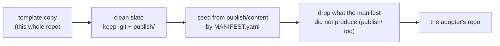

**Owner:** svayam-rkant

---

# Repository structure — and the one door to an adopter

## The rule: the MANIFEST is the only way a file reaches an adopter

This repository is also the **GitHub template** every adopter's governance repo is created from, so
`gh repo create --template` copies **all of it** into a new adopter repo. `gov setup` then:

1. **clean slate**: removes every root entry except `.git` and `publish/` (`cleanSlateEntries`);
2. **seeds** the adopter's tree from `publish/content/` by `publish/content/MANIFEST.yaml`;
3. removes every root entry the manifest did not produce, **`publish/` included** (`strayRootEntries`).

So, when you change this repo:

| You add… | It reaches adopters? | To make it reach them |
|---|---|---|
| a new top-level file or folder (`site/`, `install.ps1`, …) | **no**, and that is correct | only if an adopter needs it: put it under `publish/content/` and add a MANIFEST row |
| a file under `publish/content/` | **only with a MANIFEST row** (mode: scaffold-auto · seed-once · overlay-schema) | add the row |
| code under `publish/actions/` | **never**: adopters install the CLI from npm | nothing |

**Do not bring back a delete list.** Until 2026-09-22 setup deleted a hand-kept list of framework paths, which
went stale on the next top-level entry: `svm-geneva-gov` was created with 507 files, ~450 of them this repo's
(`publish/` 436, `site/`, `install.ps1`). Two tests hold the rule instead of anyone's memory:

- `test/setup/create.test.ts`, "only what the manifest produces reaches an adopter": runs the rule against
  **this repo's real root and real MANIFEST**. Any root entry you add that would survive fails it.
- journey `30-adopter-bob-default.sh`: founds an adopter from a full copy of this repo (as GitHub does) and
  asserts none of the framework's files are in it.

Adopter repos created **before** the fix still hold the leftovers. `gov doctor` reports them (by fingerprint,
never an org's own folder of the same name) and `gov upgrade --apply` / `--pr` removes them
(`TEMPLATE_LEFTOVERS` in `publish/actions/ts/src/maintain/upgrade-sync.ts`).

## Layout

| Path | What | Reaches adopters |
|---|---|---|
| `publish/actions/ts/` | the gov CLI (TypeScript), its tests (`test/`, `e2e/`) | via npm, as `@svayam-opensource/gov` |
| `publish/content/` | what adopters get: `governance/` (framework doctrine, overwritten on upgrade), `agent/` (the harness), `knowledge/` (the org's, shipped empty), `org-config.example.yaml`, `MANIFEST.yaml` | **by MANIFEST row only** |
| `publish/actions/deprecated/` | the retired Bash tooling (`setup.sh`, …), kept for reference | no |
| `site/` | the install site (the `gov-install` unit: `gov.svayamtech.com`) | no |
| `install.sh`, `install.ps1` | the installers the site serves | no (served, not copied) |
| `knowledge/` (this folder) | **this repo's** knowledge, for agents working here (layer 3) | no |
| `AGENTS.md`, `CONTRIBUTING.md`, `README.md` | for contributors to this repo | no |
| `agent/`, `ci/`, `docs/`, `packages/` | this repo's own working copies and tooling | no |
