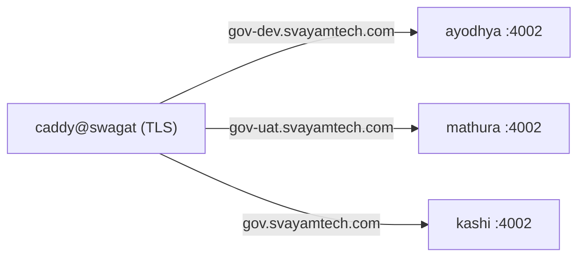

# The install site — `gov.svayam.ai` (#231)

One static page per environment, serving `install.sh` and `install.ps1` from an address a person can
say out loud.

```bash
node site/build.mjs prod --verify     # → site/dist/prod/
node site/build.mjs uat  --verify
node site/build.mjs dev  --verify
```

`site/dist/` is build output and is not committed.

## Why it exists

Two problems, and only one of them is cosmetic.

**The `main` pin is the one that matters.** The only install URL in the tree points at
`raw.githubusercontent.com/.../main/install.sh`, so every adopter gets whatever is on `main` at the
instant they run the one-liner — including a half-merged change. The project already applies release
discipline to third-party vendors (#201, the catalog freshness check) and did not apply it to its own
front door.

**The address is unsayable**, which matters for a one-liner that *is* the product's first impression.
Peers: `sh.rustup.rs`, `get.docker.com`, `bun.sh/install`, `astral.sh/uv/install.sh`.

## Each host pins two things

That is what makes three hosts worth more than three DNS records. `site/envs.json`:

| Env | DN (derived) | Serves ref | Installs |
|---|---|---|---|
| prod | `gov.svayamtech.com` | `gov-work-1.2.3` | `@svayam-opensource/gov@1.2.3` |
| uat | `gov-uat.svayamtech.com` | `uat` | `@svayam-opensource/gov@1.2.3` |
| dev | `gov-dev.svayamtech.com` | `dev` | `@svayam-opensource/gov@1.2.3` |

All three pin the **same client**, because there is no prerelease channel to pin to: the published
package carries exactly one dist-tag (`latest → 1.2.3`) — no `next`, no `uat`, no `dev`. Pinning at
a channel that does not exist fails with `No matching version found`. They differ only in the
**script** ref until gov publishes a prerelease channel.

`ref` is what the deploy checks out; the build bakes it into the page so the site states out loud
which ref it is serving. The client version is rewritten into the copied `install.sh` — `GOV_PKG` was
already overridable at `install.sh:36`, so no installer change was needed.

**Releases are gov's tags, `gov-work-<semver>`**, cut by `gov promote gov-work --to prod` at the commit
the published artifact was built from (Svayamtech/910-GOV-CICD#274). Nothing else tags or publishes
(decision 2026-09-17). After a release: set `prod.ref` to its tag, `prod.pkg` to its version, and add
the tag to `versioned` — in one commit, or the site advertises a version nobody can install.

1.2.2 is the exception: its client was built from `c05aa80`, which predates the installer, so it has
no `/v/1.2.2/` pair. From 1.2.3 the installer and client are one release tag.
`--verify` refuses a prod ref that can move — a gov release tag or a full commit sha only. `--verify` catches an unpinned build; it cannot catch a pin to a version
that was never published.

## Where it deploys — catalog unit `gov-install`, through gov

The site is an ordinary governed unit (Svayamtech/svm-prj-work#426), modelled on `portal-web`: a container
behind the Caddy edge on swagat, which terminates TLS. There is no CI job and no hosting product.



```yaml
- id: gov-install
  type: app
  sub_type: spa
  packaging: container
  source: { repo: svayam-opensource/governed-agentic-dev-framework, path: site }
  build: { context: path, dockerfile: Dockerfile }
  serve: { ports: [4002], health: /healthz }        # private endpoint — only the edge reaches it
  web: { edge: caddy, slug: gov }                   # DN derived per env: prod bare, else -<env>
  hosts: { dev: ayodhya, uat: mathura, prod: kashi }
```

```
gov-cicd deploy  gov-install --env dev
gov-cicd promote gov-install --from dev --to uat
gov-cicd promote gov-install --from uat --to prod    # after the uat → main PR
```

**One image, every environment.** gov builds a container once at dev and promotes that image. So
`Dockerfile` builds every env in `envs.json` into it, and `caddyfile.mjs` serves each request from its env's
build, matched by Host. The host names are read from each build's `CNAME`, so the DN rule lives only in
`build.mjs`.

**Why the image build clones.** `build.mjs` reads `install.sh` at pinned refs (`uat`, `dev`,
`gov-work-<semver>`). The deploy checkout is `--depth 1` on one branch, and its `.git` carries the job's
token. The repository is public, so the Dockerfile clones it anonymously and lays the deployed commit's
`site/` over it.

**A missing path is a 404, never a page.** There is no fallback, so an adopter can never pipe HTML into a
shell. An unknown host is a 404 too. `install.sh` and `install.ps1` are `text/plain`, because `irm … | iex`
needs a string.

`npm test` in `site/` is what gov's container recipe runs. It needs no git history and no network.

### Interim: `gov.svayamtech.com`, not `gov.svayam.ai`

The DN convention hardcodes the apex, so a second SLD is not expressible yet.
**Svayamtech/910-GOV-CICD#273** requests `app_domain` + `base_domain`, and carries a second
requirement — `former_domains:`, rendering permanent path-preserving redirect vhosts — so the
eventual switch keeps existing one-liners working. `curl -fsSL` already passes `-L` and `irm`
follows redirects, so no adopter command changes.

Change `base` in `envs.json` when #273 lands.

### Build status

`install.sh` is read from the **pinned ref**, never the working tree.

**Builds since 2026-09-17.** The branch split is closed, PRJ-121 is promoted to `main`, and prod pins
immutable refs, so `node site/build.mjs <env> --verify` passes for all three environments. What remains
is the deploy through gov: 910-GOV-CICD#282, then the `gov-install` unit.

## What `--verify` asserts, and why

The adopter-facing command fetches `/install.sh` to a file, then runs it. The single worst outcome
is a host answering with **HTML** — a redirect notice, a 404 page, a client-side router — which is
then handed to a shell. It fails silently and confusingly. So:

- `install.sh` begins with a shebang and neither script looks like HTML;
- both pins actually applied, asserted against the **output** rather than trusting the substitution;
- no `raw.githubusercontent.com` URL for our own artefact survives;
- the page's primary command fetches to a file and does **not** pipe `curl` into `bash` — piped, a
  failed download exits 0 and installs nothing (`docs/installing.md`); the one-liner appears only
  as the CI form;
- the page carries no unsubstituted `{{TOKEN}}`, and states its host, ref and package;
- a non-prod build carries its environment banner and prod does not;
- prod pins a ref that cannot move, and every `versioned` entry is a gov release tag.

This is why the scripts are copied as plain files beside the page rather than served through anything
that could decide to be clever.

## Still to do

- **Checksums (#205).** The Node-tarball half is now done in `install.sh` (verified against
  nodejs.org's `SHASUMS256.txt`, refusing rather than warning). Publishing `install.sh`'s own hash
  is NOT done and should not be done beside the file on this host — whoever controls the host
  controls both. It belongs with the release — gov's `gov-work-<semver>` tag — not on this host.
- **The repo's own copies of the URL.** `install.sh` holds it in one overridable constant; the
  literal in `docs/testing-the-adopter-path.md` is a tester's command and deliberately still points
  at `raw.githubusercontent.com`, because a tester must be able to run the installer before a site
  exists.
